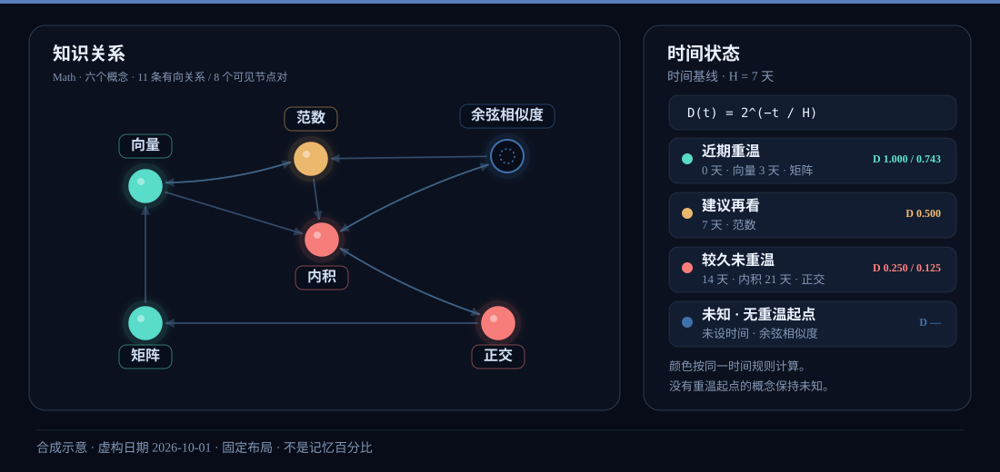

# Living Memory

把 Markdown 知识库变成动态知识图谱，并用明确的重温时间、回忆与应用记录，帮助你管理已经学过的知识。

适合持续阅读、研究和工作中积累概念的人：既想保留原理与细节，也想在遇到实际问题时主动想到适用知识。日常以阅读、查询和工作为主，附带少量复习。

目前是**桌面优先的本地 Web 原型**，源码采用 [MIT 许可证](LICENSE)。首个预览版本 **0.0.1-preview.1** 已[发布](https://github.com/wolfhawkld/living-memory/releases/tag/v0.0.1-preview.1)，默认只访问本机；完整 v0.1 路线继续迭代。[版本说明](docs/releases/v0.0.1-preview.1.md)记录使用范围和验证边界。



图中概念来自仓库示例笔记，布局与重温日期为固定演示值。这是时间状态示意图；实际 3D/2D 交互请按下面步骤运行。素材数据与复现方法见[示意图说明](docs/assets/README.md)。

## 快速开始

推荐 **Node.js 22.23.1**，与 [`.nvmrc`](.nvmrc) 和 CI 一致；已验证 npm 10.9.8。以下使用固定预览 tag；参与开发使用 `develop`，见[贡献指南](CONTRIBUTING.md)。

```bash
git clone --branch v0.0.1-preview.1 --single-branch https://github.com/wolfhawkld/living-memory.git
cd living-memory
npm ci
npm run build
npm start
```

打开 `http://127.0.0.1:4317`，自行创建第一个管理员账号，**没有默认密码**。默认载入 16 个合成概念，不需要安装 progressive-kg 或准备个人知识库。

首次图谱进入使用虚构日期的“示例状态”。点击“查看真实记录”后，新概念没有确认重温日期时显示“未知”；实际完成重温后再确认时间。示例预览不会写入真实学习记录。

[新人运行指南](docs/development/first-run.md)包含环境准备、自有 Markdown 格式、数据目录、成员知识源、CLI 认证与常见问题。开发时使用 `npm run dev`，页面为 `http://127.0.0.1:5173`。

## 可以做什么

| 任务 | 当前能力 |
| --- | --- |
| 浏览知识结构 | Three.js / `3d-force-graph` 的 3D 与 2D 视图、深浅主题、发光与空闲旋转；按目录切换领域、全库搜索、按需展开跨域关联 |
| 阅读和查询 | Markdown 大窗阅读、表格、公式、图片与 Mermaid；Web 和 CLI 使用完整知识索引 |
| 跟踪学习状态 | 明确确认重温或补记估计日期，按时间显示颜色；逐概念历史、资料版本提示、本人确认长期保持及手动恢复衰减 |
| 练习回忆与调用 | 先回答再看资料、作答前信心、提示条件与核对结果；场景调用与回访，自建细节 / 辨别 / 场景卡，分阶段提示与召回 / 适用理由自评，少量复习与安排 |
| 整理使用与修正 | 应用/总结记录、insight 与知识修正建议；薄弱点、时间与表现对照、回忆变化和待处理建议总览 |
| 保存与衔接 | 本机管理员/成员各有私人知识与学习记录；JSON 导出及预览恢复、概念改名/移动后的人工历史衔接、待同步重试 |
| 融入日常通道 | CLI 查询与明确确认重温，可选 progressive-kg 的成功收尾刷新钩子，Web 接收变化通知 |

`develop` 另有默认关闭的[飞书绑定与知识阅读通道](docs/development/feishu-knowledge-reading.md)：本人私聊指令查看领域、搜索、排序和分页正文，读取不会更新记忆。文本浏览软件链已实现；真实飞书往返、点击式卡片与复习写回仍待验收或开发，尚未包含在上述固定预览 tag 中。

## 典型用法与记忆规则

阅读或工作时，可搜索概念、查看关系和资料。需要检验独立回忆时，在本次作答前未看目标资料、未受答案提示的条件下，先用自己的话解释，或从工作场景写出想到的概念与理由，再看资料、核对并保存观察。已查阅过资料或受过提示时如实标记；独立比较还需没有相反曝光记录，并有明确的结果与核对依据。

实际完成重温后，单独确认时间起点；下一次可用少量复习与总览选择值得再看的概念。

当前时间基线是 `time-only-v0`：`D(t) = 2^(-t/H)`，全局 H 默认 7 天。**D 是时间提示，不是记忆正确率**，H 也不是测出的个人遗忘参数。内容版本变化会提示重新确认，未知节点不会从笔记修改时间推断学习日期。

浏览、查询、生成和刷新不会自动确认重温。回忆观察、场景调用、信心与实际应用分别记录，目前不自动调整 H；软件测试通过也不代表已证明记忆收益。长期保持由本人设置，只有手动解除才恢复时间衰减。

工作中没想起的概念，可以通过[场景回访](docs/development/scenario-revisit.md)再次先答后核对；同场景练熟不等于能迁移到新问题。核对后可主动进入应用 / 总结草稿，补充适用条件、局限和 insight。

已有的[细节与辨别练习卡](docs/development/practice-cards.md)支持人工维护问题、出处和参考答案，先答后看；练习记录与整个概念解释的成绩独立，资料变化后先复核。

已有的[人工场景卡](docs/development/scenario-cards.md)保留无提示原答，按需逐步查看结构或名称提示，分别核对候选召回和适用理由。同案例重练不代表已经能迁移到新问题。

项目当前反馈是手工练习卡维护负担较高，已暂缓把它作为日常主线；现有功能和记录保留。后续计划改为[自动设计与维护、少量确认](docs/planning/automatic-practice-backlog-2026-10-02.md)，自动化尚未实现。

学习流程与证据边界见[个人记忆强化流程](docs/design/personal-memory-workflow.md)和[记忆研究汇总](docs/research/consolidated-findings.md)。

## 数据与当前边界

知识源为只读 Markdown，默认使用 `fixtures/demo-kg`；可通过 `LM_KG_ROOT` 接入自己的合规笔记。账号与学习记录默认保存在被 Git 忽略的 `data/local/`，使用 SQLite；页面导出的 JSON 是学习数据交换/恢复格式。原知识库不会被改写，不要求贡献者拥有同一份私人 vault。

每个成员拥有独立知识根目录与学习空间。当前是本机账号隔离，尚未提供在线协作、共享知识空间或知识融合。管理员的知识根路径决定学习空间，移动整个根目录不会自动衔接历史；详细规则见[账号与知识域](docs/development/private-accounts.md)、[导入恢复](docs/development/learning-data-import.md)与[概念身份](docs/development/concept-identity.md)。

完整备份需停止服务后保留整个数据目录与外部知识库；JSON 包括练习卡题干、参考答案及自己的回答，不含原知识正文文件、附件、账号密码或浏览器草稿。浏览器待同步记录与复习草稿另存在本机，不能只靠服务端备份恢复。

Windows 原生首次运行的命令、HTTP 与 CLI 已有[实测记录](docs/development/platform-validation/windows-2026-10-01.md)；macOS 暂缓，当前未验证；真实桌面 GPU 与大知识库性能仍待验证。图片/Mermaid 等专项人工验收情况见[迭代 TODO](docs/planning/iteration-todo-2026-09-22.md)。ChatGPT 语音资源接入、Obsidian 插件、社交、在线/跨设备同步与移动端属于后续范围。

## 验证与路线

2026-10-01 已在 WSL2/Linux x86_64、Node 22.23.1 下验证隔离目录安装、构建、首次建号、知识源接入和重启保留。[发行提交 `1c7a639` 的 CI](https://github.com/wolfhawkld/living-memory/actions/runs/36852873767) 通过 496 项 Node/HTTP 测试、构建、主题检查和 10 项浏览器回归。该结果验证软件路径，不构成目标设备性能或学习收益结论。

同日使用 Windows 原生 Node 22.23.1、npm 10.9.8 验证 `develop` 提交 `c8cd557`：干净源码安装、构建、服务建号、16 个概念/32 条关系、CLI 查询与明确重温、停止重启保留及幂等重试均通过。源码由固定提交归档提取；未测试 Windows Git clone、浏览器视觉或 GPU，也未重新验证已发布 tag，详见上述 Windows 记录。

开源运行文档、有限范围的公开内容检查、贡献约定、[模块导览](docs/development/codebase-guide.md)和[首批协作任务](docs/planning/first-contribution-tasks.md)已整理。[更新记录](CHANGELOG.md)、[版本兼容约定](docs/releases/versioning-and-compatibility.md)和[升级恢复步骤](docs/releases/upgrade-and-recovery.md)提供预览维护基础；本次发行的精确提交、自动检查与源码归档核对结果见 [GitHub 发布说明](https://github.com/wolfhawkld/living-memory/releases/tag/v0.0.1-preview.1)。记忆模型扩展依据实际延迟观察推进；完整 v0.1 路线尚未整体验收。

- [开源准备与完成记录](docs/planning/open-source-readiness-2026-09-27.md)
- [近期迭代与未验收项](docs/planning/iteration-todo-2026-09-22.md)
- [预览范围与发布清单](docs/releases/local-web-preview.md)及[实际发布记录](docs/releases/preview-publication-2026-10-01.md)
- [完整文档导航](docs/README.md)：功能说明、设计、研究与历史记录

## 参与协作

欢迎改进运行文档、合成示例、测试和独立功能。先阅读[协作说明](CONTRIBUTING.md)，在 [Issues](https://github.com/wolfhawkld/living-memory/issues) 描述问题或确认任务范围。维护者日常沿用 `develop`；外部贡献者可 fork、使用短期分支，并向 `develop` 提交 PR。经过验证的一组改动再集中合入 `main`。

定位实现请看[模块与数据流导览](docs/development/codebase-guide.md)，第一次参与可从[首批可认领任务](docs/planning/first-contribution-tasks.md)选择。

安全漏洞使用[私密报告入口](SECURITY.md)，社区交流遵守[行为准则](CODE_OF_CONDUCT.md)；维护责任与分支约定见[维护者说明](MAINTAINERS.md)。

逻辑改动按范围运行 `npm test`、`npm run build` 和相关检查，使用合成知识源与临时数据库。记忆规则的改变需要说明研究依据、证据边界和数据兼容；个人数据库、知识库、凭据与会话记录不提交。

本项目采用 [MIT 许可证](LICENSE)，版权归属 Damon Long。第三方依赖和外部知识资源遵循各自许可证，见[第三方许可检查](docs/releases/third-party-licenses.md)。
