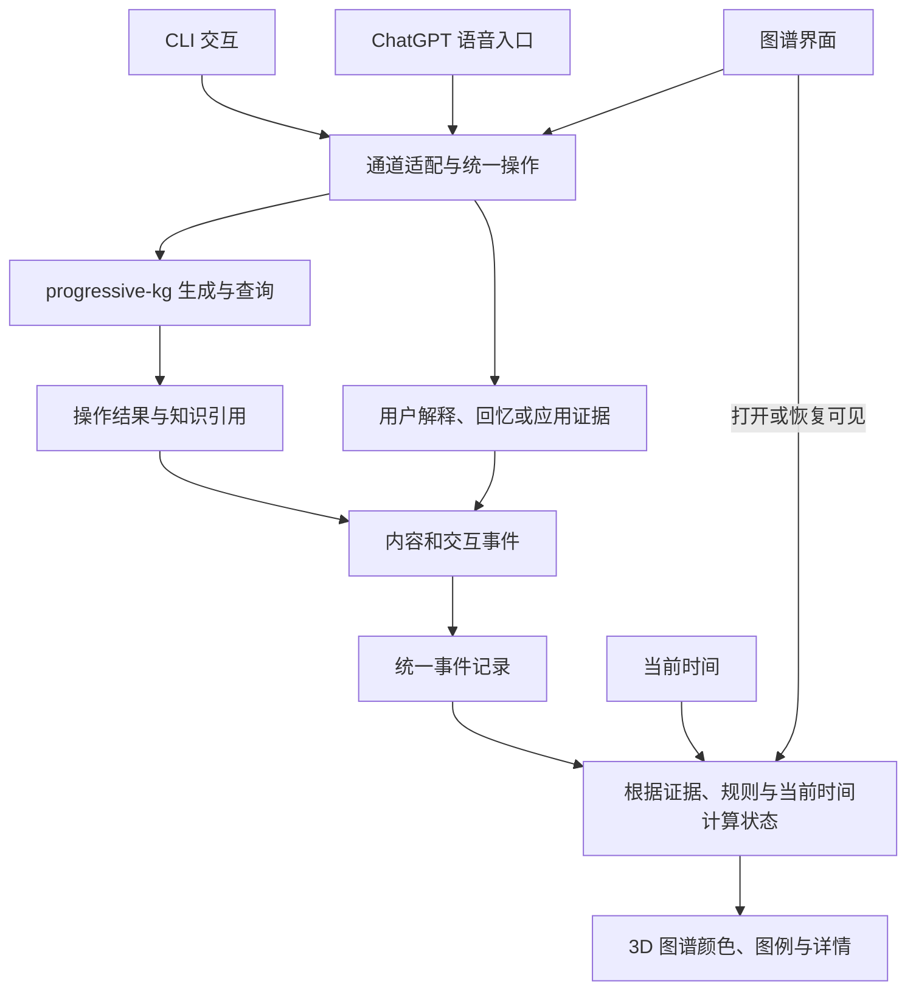

# 日常事件触发、按需状态计算与语音通道

日期：2026-09-15。用户新增设计要求：借助 progressive-kg 已有图谱生成与查询通道，隐式完成记忆图谱展示所需的衰减计算；增加 ChatGPT 语音，作为 CLI 之外的触发通道。本文将要求纳入现有流程，尚未实施接入。

## 1. 设计方向

复用已有工作入口，让生成、查询、阅读与使用顺带推动状态刷新。用户无需另行运行“更新遗忘状态”的命令。新增语音通道与 CLI 共用相同的知识操作、学习事件和状态计算；3D 图谱读取结果并响应变化。



图中是职责分工，可以在同一应用或插件进程内实现；不要求独立消息服务、服务器集群或为 CLI 与语音各维护一套记忆库。

## 2. 衰减计算与新证据更新

需要区分两个动作：

- **按当前时间计算状态**：给定原有证据和规则/模型，回答“现在应怎样显示”。每次查询、生成或打开图谱都能触发，不要求本次发生回忆练习。
- **记录新的学习证据**：用户确实解释、回忆、使用或纠正某个目标时，记录相应表现和提示条件，之后影响估计。

可将计算关系表达为：

```text
当前显示状态 = project(有效事件, 知识与任务版本, 规则或模型版本, 当前时间)
```

刷新时从有效事件和时间重新计算，或者更新可重建的缓存；不要每刷新一次就再次扣减已衰减值，也不要把“本次查询时间/上次渲染时间”当成新的学习起点。单纯多次打开图谱，不能导致遗忘加速或记忆恢复。

当前流程 v0.1 仍以透明再访规则和表现记录为基础，可以按时间显示再确认窗口。真正的连续遗忘曲线要在后续模型选择与校准后加入；相同触发接口可以保留。缺少历史学习记录时显示未知，不使用笔记创建/修改时间虚构学习日期。

**按需计算不会漏掉离线期间经过的时间。** 关闭一周后重新打开，直接使用当前时间与原有证据计算即可。图谱持续可见时可在下一状态边界或适度的定时刷新点更新；无需按渲染帧率重算。提醒若以后需要后台调度，另行设计。

## 3. 日常动作提供什么信息

| 动作 | 可以记录什么 | 对记忆展示的作用 |
| --- | --- | --- |
| 生成或修改概念 | 内容变化、引用、版本、操作者及来源 | 建立/更新图节点，检查旧目标是否仍适用，刷新当前状态；自动生成本身不证明用户学会 |
| 用户发起查询 | 查询意图、返回的概念/章节及结果范围 | 刷新当前状态，记录查询；不自动重置复习间隔 |
| Agent 为准备回答读取材料 | 工具访问与上下文加载范围 | 保留系统操作来源，不能当成用户已经阅读或听到 |
| 内容实际呈现/播报 | 能观测到的文本或音频呈现范围、结束/中断情况 | 可作为接触信息；呈现或播放也不证明理解和掌握 |
| 用户先解释再查询 | 提示前的回答、目标、随后提供的资料与反馈 | 经核对后形成该条件下的表现证据 |
| 用户口述“这次没想到” | 自述的问题情境、相关概念和提示来源 | 标记场景调用缺口；不扩大成全部细节遗忘 |
| 打开或重新生成图谱视图 | 视图范围与当前时间 | 重新计算显示状态，不额外产生学习成功记录 |

查询关键词与提到概念名称可以表明兴趣或意图，但不直接证明细节掌握。实际返回 L1 定义时，只记录该范围，不把未呈现的 L2/L3、邻接节点或检索候选都记为已学。普通闲聊里未明确属于个人学习表现的语句，保留原始语境或未知分类。

系统可自动完成记录与刷新，用户应能查看状态变化依据并修正误归因。任务提示、直接查询与少量主动练习仍可沿用[现有流程](personal-memory-workflow.md)。

## 4. 最小通道与事件契约建议

已只读核查 progressive-kg 的 AGENTS.md、SCHEMA.md 和 `_system/OPERATIONS.md` 及相关工具：目前 Ingest/Query/Consolidate 是 Agent 工作流约定，已有可执行脚本主要负责 lint、迁移与格式修复，检查范围内未发现用于这些知识操作的专用 CLI/API 或事件订阅接口。接入需要补充外层适配，不能假设已经有现成 callback。[知识库上下文](../research/progressive-kg-context.md)

| 现有流程 | 已有步骤 | 候选事件边界 |
| --- | --- | --- |
| Ingest | 查重、生成分层内容与关系、写文件、lint、追加日志、报告 | 确认流程成功后记录内容变化及实际文件范围 |
| Query | 检索、读 L1 与 L2 概览，按需读 L3、合成引用答案，可选归档 | 答案产生时记录查询结果；向用户呈现范围另记 |
| Consolidate | 域扫描、重复/缺链分析、修改或建议、lint、报告 | 记录结构或内容变化，不追加人类学习成功 |

Query 不必改写笔记 `updated`。现有日志与日期不提供完整事件/操作 ID；可将内容摘要或仓库快照作为版本依据，具体策略在实现时确定，不依赖人工日期识别每次内容变化。整理流程与 Schema 对 `verified` 的使用存在需要核对的表述差异，接入时遵循实际事实核验含义；本轮未修改该库规则。

通道适配器将 CLI、语音和图谱 UI 请求映射到同一操作集合，例如查询知识、生成/更新知识、打开相关子图、记录一次解释或使用。具体接口名称在实现时确定。

事件至少需要：

- `event_id` 与 `operation_id`：识别一次事件和一次实际操作，重试或多通道接收结果时去重。
- `occurred_at` 与必要的接收时间：区分实际发生时间和稍后补写；历史时间无法确定时保留来源和不确定性。
- `channel` 与 `actor`：区分 CLI/语音/UI，以及用户/助手/系统。
- 知识稳定引用、章节/关系范围、内容版本，以及操作成功/失败状态。
- 涉及学习表现时附加任务/尝试 ID、用户回答、可见/已播报线索、资料帮助、反馈依据和证据类别。

知识操作与学习事件不能只依赖文件 mtime 推断。自动整理、同步、lint 或内容迁移都可能改变文件，但不代表人类学习。

在实际操作边界记录事实：请求已收到、内容已成功改变、查询结果已产生、结果已呈现、用户回答已完成，是不同阶段。工具调用尚未成功时不记为完成；语音转写的临时片段、同一回答的流式更新、重复提交不产生多份成功证据。

查询结果优先返回；事件写入失败可以记录待补写状态并按同一标识恢复，不把记录失败解释为用户记忆失败。内容版本与缓存版本发生变化时失效重算，已发生事件保留可追溯更正。

## 5. 已确认的语音入口与资源接入

用户已明确回复：**目前先在 ChatGPT 中语音交流，并确保可访问本项目图谱资源；将来 Codex CLI 的语音能力适合本机工作流时，再优化入口。** 因此首阶段采用现成 ChatGPT 语音。内置 OpenAI API 语音保留为后备，不纳入首阶段实施范围。具体 ChatGPT 客户端、host 和连接可用性仍需验证。

### 首阶段：ChatGPT 现成语音入口

OpenAI Docs 当前说明：ChatGPT 桌面 Voice 可以发起、检查和协调 Codex 任务；在支持的已有任务中，语音可以利用任务上下文继续工作。具体可用性受到客户端/host 版本、账号、工作区和推出进度影响。[官方 ChatGPT Voice 文档](https://learn.chatgpt.com/docs/features/voice)

据此可优先验证：**ChatGPT Voice → 能访问 progressive-kg 的已连接 Codex host/任务 → 原有生成/查询工作流 → 统一事件记录 → Living Memory 状态刷新**。

这是依据产品能力提出的接入方案，尚未验证用户设备和当前 CLI 会话能否直接由语音继续。不能默认普通 ChatGPT 对话自动获得本地文件、任意 CLI 会话或事件日志。现成语音入口可以先负责发起生成/查询；若要记录口述回忆表现，还需确保用户回答与提示阶段能完整、准确地传入学习记录，不能仅记录模型总结。

ChatGPT Developer mode 另有通过远程 MCP 接入读写工具的公开路径，但该文档本身不能证明任意客户端的语音模式都支持相同工具组合；具体路径需单独验证。[官方 Developer mode 文档](https://developers.openai.com/api/docs/guides/developer-mode)

### 图谱资源可访问是接入验收条件

语音回答应来自可追溯的项目资源。资源分为三类：

| 资源 | 来源与当前状态 | 查询需要保留的信息 |
| --- | --- | --- |
| 概念、章节、关系与来源 | progressive-kg 中的真实 Markdown；当前已经存在 | 真实笔记引用、章节、关系类型、内容版本/摘要，以及本次实际读取范围 |
| 个人学习事件与记忆状态 | Living Memory 后续实现的记录与状态计算；当前尚未建立 | 用户/目标、提示与反馈依据、事件版本、状态计算时间；无记录显示未知 |
| 任务与展示上下文 | 当前项目定义、任务/目标和后续图谱焦点 | 当前问题、候选是否已暴露、选中目标；不能只由截图推断完整知识结构 |

优先验证已连接 Codex host 的文件访问路径。OpenAI Docs 说明桌面本地项目可以附加多个目录，因此在同一本地 host 上可考虑以 Living Memory 为主目录，附加 progressive-kg。次级目录的 AGENTS.md 等不会自动发现，知识操作适配层仍需显式遵守 progressive-kg 的入口与 Schema 约定。项目目录配置也不替代实际文件权限验证。[官方本地项目文档](https://learn.chatgpt.com/docs/projects#use-local-projects-for-folders-and-codebases)

每位协作者分别配置 Living Memory 的项目目录和 progressive-kg 的知识库目录。已检查的环境通过 symlink 访问 Windows 挂载下的知识库；换到 Windows 桌面 host 或其他主机时，需要验证真实路径与挂载，不能直接照搬他人的路径或仅检查 symlink 是否存在。远程项目当前只支持一个项目目录；若使用远程环境，应单独验证额外知识目录能否通过受限资源接口或实际文件权限访问，不能套用本地多目录配置。

官方 Remote 路径可以让已连接主机提供项目文件与工具；具体语音支持仍以所选客户端与任务为准。该路径的可行性不等于本项目当前已连接。[官方远程连接说明](https://learn.chatgpt.com/docs/remote-connections)

### 未来：Codex CLI 语音入口

CLI 语音达到可用条件时，接入同一组知识查询、内容操作、学习事件与状态查询能力；更换的是输入/输出适配，不复制知识库，也不重建学习历史。语音转写与提示条件的记录仍需保留。未来支持何时出现、是否稳定，不能作为当前实现的前置依赖；是否已有实验能力应与“已在用户设备验证可用”分开。

本地只读检查记录：`codex --version` 为 0.154.0，`--help` 没有公开语音/实时对话命令；`features list` 显示 `in_app_dictation stable true`、`realtime_conversation removed false`。特性注册项和二进制中的内部名称不足以证明 CLI 已支持可用的双向语音，本轮未启动麦克风或实际语音会话，也未改动特性配置。

### 后备：在 Living Memory 或 Obsidian 中内置语音

若需要更直接控制语音与图谱联动、答题开始、提示播放和中断，可研究 OpenAI Realtime API。官方文档支持实时会话调用 function 工具；应用执行本地业务逻辑后返回结果，也支持另行配置远程 MCP。[官方 Realtime 工具文档](https://developers.openai.com/api/docs/guides/realtime-mcp)

候选过程：语音会话 → 调用同一知识/学习接口 → 返回检索结果或记录结果 → 播报并更新图谱。此方案需要自行实现语音 UI、会话与工具管理；它属于 OpenAI API 集成，不能把它写成直接嵌入 ChatGPT 客户端。

无论入口如何，语音停顿、识别延迟、被打断、网络失败或读错术语不能直接判为遗忘。保留可纠正的转写、原始用户表达和已提供提示范围；由任务证据与反馈决定状态。

## 6. 接入验证目标

1. 相同知识查询分别从 CLI 与语音触发，返回一致的知识引用；同一次操作不重复入账。
2. 单纯刷新十次图谱与刷新一次，固定时间下得到相同记忆状态。
3. 模拟关闭一周再打开，能按原有记录计算当前再访状态，无需每日后台扣减。
4. 查询/自动生成刷新展示但不自动记为独立回忆成功；实际解释按对应目标更新。
5. 仅返回定义不影响未展示细节的学习历史；语音被打断时不虚构完整内容已呈现。
6. 事件写入重试、纠正转写、修订反馈、内容重命名/修改后，历史与状态仍可追溯。
7. 从选定 ChatGPT 客户端用语音查询一个真实概念及其关系，返回知识库文件/章节引用，并与 CLI 返回内容核对。
8. 在一份非敏感测试材料发生已知变更后再次语音查询，确认读到更新并说明引用版本，避免只依赖会话旧内容或静态上传快照。
9. 学习事件与状态接口实现后，从语音和 CLI 读取同一目标的状态、计算时间与依据，确认一致；当前未建立的记录明确显示未知。
10. 分别验收语音读取、知识生成/修改与学习事件写入：读取成功不自动证明写入与事件链路已经接通。

本轮只完成设计与公开能力核查。尚未更改 progressive-kg 的指令或脚本、接通语音、建立事件存储、启动后台任务或调用付费语音接口。
