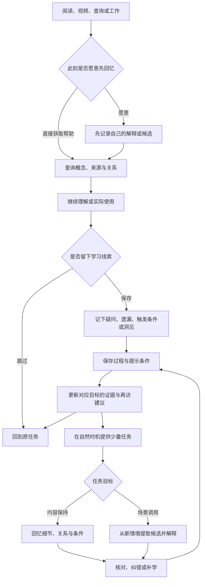

# 个人记忆强化系统流程 v0.1

日期：2026-09-15。依据[共研结果总结](../research/consolidated-findings.md)形成的首份系统流程设计。用户已要求进入流程设计；下述默认值和交互是可试用、可修改的方案，尚未实现或验证学习效果。本文维护学习流程与证据规则；客户端、数据库和复习模型仍待确定，图形引擎的后续决定见下文。

后续进展：用户认可流程大方向，明确桌面优先及突出空间、发光、镜头运动的偏好，并在查看官方 Demo 后确认 `3d-force-graph` + Three.js 可视化技术方向。[视觉方案](visualization-spec.md)与[技术选型](../research/visualization-options.md)单独维护；该确认不代表本流程已经实现或验证。

## 1. 系统要帮助形成的变化

围绕两个主目标安排任务：**已学概念的关键内容能够保持；真实情境能够唤起相关知识。** 应用条件判断、实际使用和认知修正作为独立证据保留。

| 用户的痛点或偏好 | 流程回应 | 观察效果 |
| --- | --- | --- |
| 名称、大意尚记得，细节逐渐模糊 | 在已有概念内选择值得保持的细节，闭卷重建、反馈、间隔再访 | 延迟后关键细节是否准确，是否仍需查阅 |
| 有实际需求时想不起相关概念 | 保存“这次没想到”的真实情境；事后做不显示候选名称的场景提取 | 未练过的场景能否自主唤起合理候选 |
| 概念相近，适用边界需要重新确认 | 比较相邻概念、理由、条件与反例 | 能否区分适用情况，减少误用 |
| 大量阅读和不定期看视频 | 在自然停顿或结束时提供可选短回忆；从来源定位到已有概念 | 能否低成本留下自己的解释和疑问 |
| 工作优先、少量复习 | 查询直接可用；训练自愿触发；用时间预算限制建议 | 能否完成工作，是否愿意继续使用 |
| 持续形成 insights 与认知迭代 | 记录观点、依据、适用边界和修正历史 | 能否说明观点为何变化，而不只增加笔记 |
| 深色、动态图谱与遗忘状态色 | 图谱连接内容、任务证据和再访建议；提供状态解释 | 能否看懂变化，避免把活跃度误认成记忆 |

orchestrator 例子仅用于理解第二种痛点。本文不求解其技术方案。

## 2. 总流程：从日常活动进入，按需要完成一部分

快速查询与练习共享同一份知识，但入口不同。用户打开搜索就能查；只有选择“先想一下”或开始练习，才进入隐藏答案的过程。用户随时可以查看答案或退出，系统记录发生过的过程。

## 3. 冷启动：复用已有积累，逐步建立个人证据

1. **接入已有知识索引。** 复用 progressive-kg 的概念、章节、关系、别名和来源。原笔记继续作为内容依据；新系统维护个人学习记录。导入不是重新学习，不自动安排全库复习。
2. **从当前关注内容开始。** 用户可以选一个正在学习的主题，或直接从一次查询开始。首次试用可选约 10–20 个相关概念；这只是试用规模，不是容量上限或必须完成的清单。
3. **按目标分配投入。** 提供“希望随时想起”“允许查阅恢复”“暂不维护”三种可随时更改的个人目标。前者进入复习候选；后两者仍能搜索和关联。
4. **在需要时做少量初始观察。** 对一个概念，分别询问是否愿意尝试核心解释、关键细节或场景调用。初次观察也算学习事件；可以跳过，不要求先测完才能使用。
5. **保留未知。** 不知道过去何时学习、当前没有回忆记录时，显示“尚未评估”。笔记创建、修改、事实核验日期不替代人类学习时间。

progressive-kg 的 L1/L2/L3 可帮助定位不同深度的内容，但内容层级不直接等于记忆等级。每个进入训练的目标先只选择少量有价值的要点，后续从实际遗漏中增加。

## 4. 四个日常入口

### 4.1 阅读和视频：留下自己的理解

触发时机是用户主动标记的一段内容、自然停顿或结束，不按固定时间中断播放。

流程：定位已有概念或暂存新材料 → 可选地收起原文、用自己的话解释一个要点 → 对照原文纠错 → 保存一条关系、疑问或触发条件 → 继续阅读。

- 最小保存内容可以只有来源链接或视频时间点，加一句自己的疑问。
- 有余力时补充“为什么成立”“与哪个旧概念有关”“在什么情况下可能用到”。不要求一次填写完整模板。
- 刚看完后的回忆标记为即时练习；即使回答正确，也不能作为延迟保持或自发场景调用成功。
- 系统生成的摘要可作为资料；只有用户实际产生的回答才作为用户学习表现。

### 4.2 查询：在快速帮助之后捕捉提取缺口

直接查询路径：输入问题 → 立即获得候选与来源 → 完成查阅 → 可选点击“这次没想到”或“细节不清楚” → 回到工作。

“这次没想到”只需留下问题原貌，并选中用户认为相关的概念；可稍后补一句“这个需求的什么特征能让我想到它”。这是一条未来练习素材，不是对遗忘原因的诊断。

若该概念已选为“希望随时想起”，该动作创建或关联一个场景调用目标：辅助获得的记录不算独立成功，新目标从短档位进入再访候选。已有目标不因此延长间隔。其余概念先只保存经历，用户可以通过“用于稍后练习”将其纳入。案例尚无可靠题目和反馈依据时标记待准备，准备好后再提供任务。

选择“先想一下”时：先展示问题输入区 → 用户写下自己的候选或说明暂时没有方向 → 再展示搜索结果。若结果、节点名或关系已经出现，则记录为已获提示，不追认成原本就想到了。

### 4.3 工作与使用：保存知识被调用的条件

流程：当前任务 → 自己提出或借助帮助获得候选 → 说明相关条件 → 使用或排除 → 可选保存结果。

最小记录是“场景 + 概念引用 + 为什么相关/为什么不适用”。有实际产物时再附结果、限制或验证依据。

系统能自动知道的界面提示如实记录；其他帮助可标记为自行想起、查资料、AI/他人提醒或未知。无需为了记录而完整复盘工作过程。

借助资料完成工作是有效的使用经历。它支持“在这些条件下使用过”，不能自动支持“独立想起过”。用户通过其他合理方法完成任务，也不因没有提出系统预设的概念而被判为漏记。

### 4.4 总结与洞见：把一次经历转成可再用的认识

在主题告一段落时，提供可选总结：先不看资料，写出少量关键认识 → 对照笔记或工作记录 → 补充遗漏、修正错误 → 保存变化及原因。

洞见包含主张、依据、适用边界、尚待验证之处；这些内容允许逐步补全。比较两次经历时，鼓励说明共同关系和差异。新的推测保留为推测，不因被记住或频繁引用就升级为事实。

需要记住的关键洞见可以进入训练；探索中的想法以再次思考、寻找反例为主，不以背诵结论作为默认任务。

主题结束时还可回看一两次学习记录：自己原先以为掌握了什么，实际在哪一步需要帮助，哪种解释或线索有用。下一次遇到新材料时，尝试主动采用有效的方法。记录只用于调整学习方式，不根据少量偏差给用户贴“记忆差”或“过度自信”的标签。

## 5. 两条训练流程

### 5.1 内容保持：概念线索 → 自己重建 → 核对

1. 选择一个具体目标，例如核心解释、一个推导环节、两概念的关系或一个适用条件。
2. 明确题目允许显示的信息。名称提示下的解释是正常任务，不叫作完全无线索回忆。
3. 用户尝试回答，可文字、口述或重建局部关系；随时请求提示或查看资料。
4. 展示来源要点，区分正确部分、遗漏与实质性错误，允许用户质疑反馈。
5. 有错误时针对性补学，再用自己的话修正。修正是本次学习的一部分，不追加一次独立成功。
6. 在之后的独立时机再次提取，根据表现调整再访安排。

提示可以逐步从结构问题、局部要点到完整资料展开，但不强制逐级经历；提示层次和展示时点都保留。对已经忘得较多的内容，直接补学比无限猜测更合适，系统允许这一选择。

### 5.2 场景调用：问题线索 → 自主候选 → 理由与边界

1. 给出一个情境，包含足以理解问题的目标、信息和约束，不出现答案概念名。
2. 暂时隐藏会泄漏答案的图谱标签、邻居、搜索结果和固定位置提示；使用独立任务面板。
3. 用户自己提出可能相关的概念，并说明联系。合理候选可能不止一个。
4. 没有方向时，按需提供结构提示，再到候选名、解释和来源；保存提示前后的答案。
5. 比较候选的适用条件，允许排除系统建议或提出其他合理方法。评判关注理由，不能只做名称匹配。
6. 之后使用表面不同、需要相近知识的新场景；也可安排相似表面但条件不同的对比例子。

同一案例反复出现可用于巩固，但不能作为新情境迁移的证据。生成一个故事换皮也不自动构成真正不同的问题；案例需要核对关键条件与答案依据。

场景保存题目身份、案例组、关键条件、答案依据与目标概念，并记录是否见过同题。若同一练习批次的前题刚展示了本题相关概念，后题标记为受到近期提示，不计作新的独立场景调用，也不据此延长间隔。不同日期的案例可以共享概念以观察迁移；共享概念本身不等于题目重复，仍需核对情境差异并保留暴露历史。

单次未提出某概念，通常不足以判定该概念已经遗忘。只有任务目标和评判依据足以支持时才更新相应证据；开放问题中的合理替代方案应保留。

### 5.3 让学习策略逐渐成为自己的习惯

初次使用时，系统可提供“解释关系、尝试回忆、核对依据”的操作引导；熟悉后收起引导，保留按需入口。用户可以在回答前简短预测自己能完成到什么程度，再与实际表现对照；该步骤可跳过，信心不参与直接判分。

后续在新材料中观察是否能主动组织知识、选择合适的练习和发现薄弱处。这样才能讨论策略是否学会并被复用；旧题越做越熟不能单独说明这种能力改善。操作引导与会泄漏答案的内容提示分开记录。

## 6. 反馈如何决定下一步

| 本次观察 | 下一步学习动作 | 状态更新边界 |
| --- | --- | --- |
| 延迟后、在规定线索下独立回答正确 | 以后再确认，可增加间隔或换任务情境 | 只支持该目标、内容版本和条件下的表现 |
| 大意正确，但关键细节遗漏 | 定位遗漏并补学；下次集中观察相关要点 | 不清零整个概念，也不推定场景调用失败 |
| 提示后能够解释 | 保存有效提示，之后在较少提示或新情境下尝试 | 记录辅助成功，不能改写为自发提取 |
| 名称给出后仍难理解 | 返回概念或前置知识，解释并核对 | 暂停把此题单纯当作提取困难处理 |
| 候选合理，适用理由有误 | 对比条件与反例 | 自发想到与适用判断分别保留 |
| 看过答案后立即答对 | 记为纠错后的重建 | 不当成延迟成功，不延长长期复习间隔 |
| 评分有争议、来源不足或内容过时 | 标记待核对，允许修订题目/反馈 | 未解决前不据此改变掌握判断 |
| 跳过、退出、没有时间或回答来源不明 | 返回原任务，记录跳过或未知 | 不当失败，不降低个人能力评价 |

AI 可建议题目、线索、差异和反馈，必须保留对应来源与可检查的理由。AI 的判断可以被更正；开放式应用不得默认存在唯一标准答案。基础流程应能用用户自评与来源核对完成，是否接入 AI 服务在后续另行选择。

## 7. 少量复习如何被安排

### 7.1 先用透明规则试运行

第一版采用可解释的安排，先验证任务是否值得做，再研究个体化遗忘模型。以下时间只是便于试用的初始设置，不是科学确定的最佳间隔：

- 可使用 `1 → 3 → 7 → 14 → 30 天` 作为候选间隔档位，含义为距离本次有效练习的等待时间。
- 新目标默认从短档位开始；已有延迟表现可支持更长档位。每个目标独立维护安排。
- 已到再访窗口，除任务预先规定的题干线索外未接受额外结构提示、候选名、答案或来源帮助，且反馈认可的独立成功，可以推进一个档位。名称提示下的解释按该任务条件评价；场景调用题干不包含候选名。部分正确或任何额外提示后的成功暂不推进；实质性失败在补学后回到短档位。
- 刚看过资料或同一练习内的纠错，不推进档位。浏览与直接查询保留接触记录，不被当成成功，也不自动取消待确认任务。
- 内容保持与场景调用的再访分别安排；会解释定义不推迟场景调用任务，借助资料使用也不重置所有细节的安排。
- 场景调用目标推进还需满足新情境和未受本批次相关提示的条件。重复同一案例的成功保留为该题表现，不单独推进面向新情境的再访档位。

系统显示“依据最近哪次表现，建议何时再试”，初版不输出未经校准的回忆概率。将来引入模型时，需要先明确预测对象、保存预测并验证，不能只凭曲线看起来合理就替换当前规则。

一次尝试从展示题目开始，到提交并完成反馈或退出结束；其中的提示、修改和重新作答共享同一尝试标识。关闭再打开页面不会把即时重做变成独立延迟测试；近期同批次的相关内容曝光也要保留。

### 7.2 限制总负担，而非追求完成所有到期项

建议试用默认：自然停顿处最多提供一个可跳过的小任务；额外主动复习控制在每天约 5 分钟内，也允许设为零。这是设计起点，用户可以改变频率和预算；不在每次查询后都弹出练习。

选择顺序：当前学习/工作中明确暴露的缺口 → 已选为希望熟记且到再访窗口的目标 → 有余力时补充近期缺少机会的其他目标。在核心内容已初步理解后，轮换内容保持、场景调用与对比任务，避免始终只做容易的定义题。

同一主题的多个缺口可以合成一次关系或场景任务，但任务实际覆盖了什么仍需分别记录。少量兴趣领域可以保留自己的机会，不强制每轮混入无关内容。

错过日期不积累必须偿还的复习量。下一次进入时，根据当前目标、历史证据与可用时间重排；未做的目标保留历史与待确认状态。暂停或降低优先级不会删除知识。

## 8. 动态状态：内容、表现、估计和建议分开

### 8.1 每个概念的个人状态由具体目标组成

默认先建立一个核心解释目标；关键细节、关系和场景调用从实际需要中增加。状态面板至少能区分：

- 核心解释及选定细节：何时、在何种提示下表现如何。
- 场景调用：是否在候选名称出现前提出过相关知识，场景熟悉程度如何。
- 适用判断与实际使用：理由是否成立、是否借助资料、结果是否已验证。
- 内容变化与疑问：哪些题目可能受笔记修订影响，哪些反馈仍待核对。

不平均成一个统一掌握百分比。场景证据不充分时显示未评估；一次失败不会使整条概念的全部能力归零。

### 8.2 保存足以解释变化的学习事件

| 信息 | 用途 |
| --- | --- |
| 概念/章节/关系引用及内容版本 | 确定实际学了什么，避免笔记改写后错误沿用旧题 |
| 任务类型、目标、题目/场景版本 | 区分解释、细节、场景调用、应用与总结 |
| 时间、同一次尝试的标识、相关前次接触 | 识别延迟和同题内连续提示，避免重复计分 |
| 原始回答及提示前后的阶段 | 保留自发部分与辅助部分 |
| 可见线索、资料或 AI 帮助 | 说明什么条件下完成，保留未知值 |
| 反馈、依据、评判者和未决问题 | 支持核对、修订与重新计算 |
| 用户可选信心、实际耗时、继续/跳过选择 | 帮助观察自我评估和使用负担；不拿速度单独评分 |

事件保存后，系统仅更新对应目标的记录、再访建议及显示状态。更正评分或题目时保留更正原因，并按修订后的有效事件重算；学习历史与估计分别导出。

内容的 `maturity`、`confidence`、`verified` 和 `review_due` 保持 progressive-kg 原有含义，不作为人类熟练度或复习日期。原笔记重命名、分拆或更改时，学习引用需要能重新定位；失效题目暂停使用，历史表现保留原版本。

## 9. 图谱如何参与强化与状态展示

新增通道设计：用户希望借助 progressive-kg 的生成与查询流程，隐式刷新记忆展示的时间衰减/再访状态，并增加 ChatGPT 语音作为 CLI 之外的入口。生成、查询和界面打开均可触发按当前时间计算；新的学习表现另行记录，不把刷新时间当作新的学习起点。共享事件与语音候选路径见[日常事件触发与语音设计](event-triggers-and-voice.md)。

深色背景、稳定的局部布局、清楚的中文标签；根据后续明确的空间与镜头偏好，优先验证桌面 3D，并保留平面阅读入口和一致的状态含义。图谱承担三个角色：查找与理解关系、进入特定任务、解释长期变化。

节点颜色保留“当前记忆/遗忘相关状态”的意图，但 v0.1 的透明规则只能产生**再访阶段和表现依据**，不能声称已经测得个人遗忘曲线。首版建议展示：

| 显示状态 | 依据与含义 |
| --- | --- |
| 尚未评估 | 缺乏目标任务证据；使用中性样式，不能当作已忘记 |
| 近期有独立回忆证据 | 展示最近成功日期和目标；不承诺一定仍能回忆 |
| 到再确认窗口 | 来自调度建议；表示值得再试，不是已经遗忘 |
| 最近表现需要巩固 | 指向具体遗漏、提示或错误；不是永久等级 |

在同一目标内，最近有效表现有待巩固项则优先展示；否则已到窗口显示待确认；尚未到窗口且有独立成功记录显示近期证据；其余保留未建立独立回忆证据及具体辅助记录。颜色与文字标签同时出现，图例注明目前依据为规则和观察。

总览默认填色对应“核心解释”这一共同目标；切到选定细节或场景调用时，必须明确显示视图目标，缺少该目标的节点保持未评估。场景调用视图首先展示自发/辅助/尚无证据，不套用核心解释的遗忘曲线。节点面板可同时查看其他目标，避免整体颜色掩盖差异。

查询路径、一次使用或新增关系采用短暂描边/路径动画；长期状态色只随相应证据或再访阶段变化。查看资料不会让节点自动变成“已掌握”。关系线说明语义或应用联系，不表示两端记忆会一起增强。

进行无候选提示的场景练习时收起相关图谱；允许用户主动打开，随后标记为获得提示。动画可减少或关闭；光照与选中状态不能覆盖状态含义。真正的概率曲线及其色段留待模型验证，演示曲线须标注为模拟数据，不进入个人学习记录。

## 10. 一次示意使用过程

以下是流程演示，不代表用户已经发生的学习记录。

| 时机 | 用户与系统交互 | 保存及后续变化 |
| --- | --- | --- |
| 看完一段关于已学概念的视频 | 自愿用一句话重建关键原理，再核对 | 即时练习；发现一个细节遗漏，只为该细节建立再访目标 |
| 工作中遇到问题，未想到相关概念 | 直接查到资料、继续工作，点一下“这次没想到” | 保存问题及概念联系，场景调用记为辅助获得 |
| 工作结束 | 补一句该问题与概念相关的条件 | 完善提取线索，不追加无提示成功 |
| 后来的一次短练习 | 系统提供表面不同的情境，先隐藏候选和图谱 | 若自主提出并正确解释，新增该条件下的独立调用证据 |
| 又一次内容练习 | 名称可见，重建此前遗漏的细节 | 单独更新细节保持；不因场景成功自动视为细节已会 |
| 查看图谱 | 点击颜色、状态或历史 | 看清为什么变化，以及尚未验证什么 |

以已纳入“希望随时想起”的概念 K 为例，场景调用目标可这样演示：

| 时间（示意） | 事件与证据 | 再访安排 | 视图显示 |
| --- | --- | --- | --- |
| 第 0 天 10:00 | 工作中查到 K，点击“这次没想到”；此前没有场景调用目标 | 创建目标，候选间隔 1 天；准备一个不同场景 | 场景视图：辅助获得，尚无独立调用证据；核心解释状态保持原样 |
| 第 0 天 18:00 | 对照资料补充使用条件 | 保留第 1 天的候选窗口，不因看过资料而推进 | 增加查阅与条件说明记录 |
| 第 1 天 10:00 | 场景任务先未想到，结构提示后答对 | 档位保持 1 天，建议第 2 天再确认 | 场景视图：提示后成功，尚待独立确认 |
| 第 2 天 10:00 | 新场景中独立提出 K，说明条件且反馈认可；本批次此前未展示 K | 推进至 3 天档，建议第 5 天再确认 | 场景视图：新增独立调用证据，保留场景及时间；核心解释仍不受影响 |
| 第 5 天没有使用系统 | 未发生任务 | 下次进入按预算重排，不累积必须完成的数量 | 保留证据日期，提示已到再确认窗口，不判为已忘记 |

若第 2 天仅复述前一天的同一案例，即使答对也只增加该题保持证据，场景调用的独立迁移记录与档位不按上表推进。

## 11. 扩展边界与第一轮验证

流程保留知识读取、学习事件、任务、评判、安排和可视化之间的逻辑边界；初版可在一个客户端内完成，无需预先拆成多项服务。宿主与模型可以替换，原始内容和个人事件应可导出及恢复。具体平台仍依照[技术载体研究](../research/platform-options.md)另行验证。

同伴讲解、提问和共同讨论可复用同一任务流程：记录别人提示之前的回答与之后的修正。个人练习无需依赖社交；以后由用户主动选择分享内容和范围，个人记忆表现与共享知识分别处理。

首轮用小组真实概念和一周到数周的试用窗口，优先回答四件事：

1. 查询是否足够直接、记录是否足够轻；跳过练习后能否立即继续工作。
2. 延迟后，目标细节是否更容易准确回忆。
3. 未练过的场景中，是否更容易自主想到并正确判断相关概念。
4. 图谱能否解释证据差异，额外使用时间是否可接受。

这些观察先说明个人可行性。后续若要区分练习、图谱或调度各自的收益，应采用相近学习投入、不同但可比较的材料及预先安排的延迟任务，避免同题练熟后误当迁移。具体方法衔接[验证计划](../research/validation-plan.md)。

第一轮流程验收包括：未评估内容不会被当成已忘记；提示后成功不显示为自发调用；合理替代答案可以成立；同题纠错不重复计数；跳过和暂停不判失败；有争议反馈不改变状态；旧内容修改不会静默把旧题结果套到新版本。先通过这些检查，再据真实使用修改时间预算、任务组合和视觉阶段。
