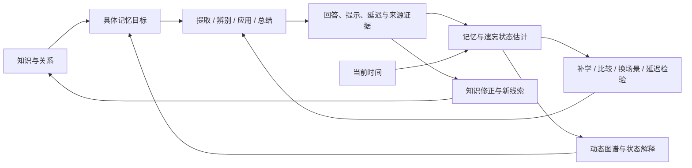
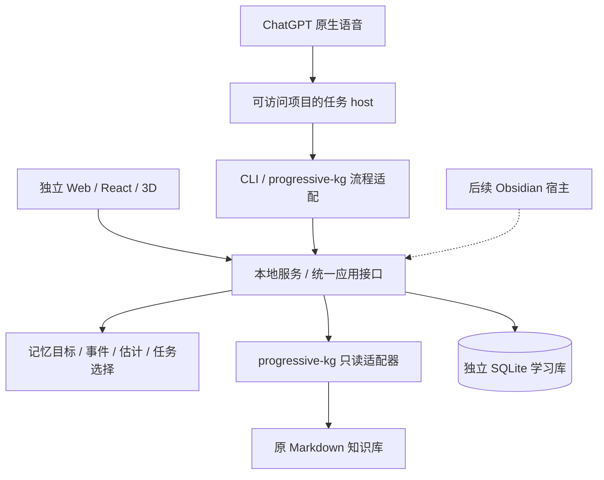

# Living Memory v0.1 技术设计

日期：2026-09-16。状态：开发提案，未实现。用户已确认 **独立 Web 原型先行，后续接 Obsidian**；已确认 3d-force-graph + Three.js。其余工程选择是本次建议，验证结果需写入决策记录。

范围更新：用户建议先以时间维度减少变量、实现验证后再扩展。因此最先实施的是 [P0 时间驱动原型](time-first-prototype.md)：一个全局参数的时间指标、明确重温记录和轻量观察。本文的多维模型、`rules-v1`、完整 API/迁移与语音保留为完整 v0.1 的后续设计，不是 P0 必须全部实现的前置条件。

[需求](../requirements/v0.1.md) · [验收](../requirements/acceptance-v0.1.md) · [任务](../planning/development-tasks-v0.1.md)。早期[学习流程](personal-memory-workflow.md)、[视觉规范](visualization-spec.md)、[事件与语音](event-triggers-and-voice.md)提供背景；首版范围和宿主以本次文档为准。

## 1. 用记忆闭环组织系统

核心不是图形节点，而是“某人能否在指定条件下、经过一段时间后，提取或使用某项知识”。同一概念至少允许四种目标：核心解释、选定细节/关系、场景提取、适用条件判断。实际使用和总结为补充证据，不能自动代替四种测试。



图谱、CLI、语音共用这个闭环。不要在渲染组件中计算掌握分数，也不要因图谱被打开或某条边亮起而修改记忆。

## 2. 记忆领域模型

### 2.1 实体与属性

| 实体 | 核心字段 | 边界 |
| --- | --- | --- |
| KnowledgeRef | source_id、concept_id、section_id/edge_id、relative_path、locator、content_revision | 路径用于定位，稳定 ID 用于关联；正文在原知识库 |
| MemoryTarget | target_id、refs、facet、评价要点、允许线索、target_revision、priority、paused | 不把整个概念视为一个不可分的掌握分数 |
| Task | task_id/version、targets、题干、提示层级、来源、scenario_family、case_id、适用/不适用条件 | 首批人工编写；同场景与新场景有明确标识 |
| Attempt | attempt_id、task/version、batch_id、started_at、回答序列、提示/查阅序列、可选预期信心、结束原因 | 关闭重开或纠错不生成新的独立延迟测试 |
| Assessment | attempt_id、逐目标结果、独立性、依据、缺口类型、争议/修订信息 | 人工自评加来源；接受合理替代答案，不能由模型自行伪造用户表现 |
| MemoryProjection | target_id/revision、observed_at、last_exposure、last_independent_recall、delay、cue_dependence、evidence_count、stage、next_due、status、uncertainty、reason_event_ids、policy_version | 是可重建估计；接触、独立成功、失败和未知分别保留 |
| LearningAction | action_id、target、原因、类型、可选混淆概念、计划时间、完成/暂停状态 | 补关键细节、核对来源、解释关系、比较概念、换场景、延迟检验 |
| Application / Reflection | 关联概念与版本、问题结构、选择理由、借助资料、使用结果/理解变化、来源 | 支持个人知识管理；不据此覆盖所有目标的状态 |

`cue_dependence` 首版展示实际观察到的提示级别与恢复情况，不输出人格化等级。巩固程度先由“在何种延迟和条件下成功过、再访档位如何变化”表达，不能把档位称为人脑存储强度。

### 2.2 观测、估计和未知必须分开

- **观测**：用户原始回答、提示顺序、实际呈现范围、自评和来源、时间、场景是否练过。
- **估计**：该目标目前处于何种再确认阶段、依据是否充分、建议何时以及用何种方式再次检验。
- **未知**：缺少学习史、无法判断是否听到/看过、评分有争议、任务与新内容不兼容。

记忆可提取性、长期稳定程度、任务难度是未来可拟合的潜变量。首版为它们保留估计器接口，但不以内容成熟度、查询次数或未经校准的单一公式代填数值。

### 2.3 后续多维版本的再访规则 `rules-v1`

这是完整版本面向分目标表现的**保守再访规则**，不是已经验证的个人遗忘曲线，也不是 P0 的 `time-only-v0`。`stage` 仅为再访档位，不能解释为记忆强度或遗忘机制。待 P0 试用后，LM-003 扩展阶段用样例轨迹审查，再扩展 LM-007。两个模型使用独立版本和图例，不同时混合驱动同一节点的颜色。

1. 默认间隔档位 `I = [1, 3, 7, 14, 30]` 天，UTC 时间戳，1 天按 24 小时计算；本地时区只用于显示。间隔、最小延迟和规则版本可配置，变更需留版本。
2. 无有效评估时为 `unknown`，`next_due = null`。旧笔记创建/修改/核验日期不能建立学习基线。
3. 第一次有依据的独立正确表现建立基线，`stage = 0`、`next_due = assessment_at + I[0]`；标注“首次基线，尚无延迟保持证据”。
4. 间隔升级要求：目标和任务版本适用；评分认可；无额外提示/查阅；已到原定再访窗口；距本次尝试前最后一次已知相关接触达到最小延迟（起始建议 24 小时）；回答来源明确。场景目标还要求不同案例、无本批次相关答案暴露、场景结构经过人工核对。全部满足才 `stage = min(stage + 1, 4)`，从本次评估时间安排下一档。
5. 提前答对可保存独立表现，但不推后原到期时间；提示后的成功、同题纠错和直接查询不升级档位，也不取消待检验事项。曝光信息不足的回答不升级，显示原因；不能保证系统捕获了生活中的全部接触。
6. 明确关键遗漏/误解且反馈已核对，记录 `needs_consolidation`，创建具体补学或辨别动作。跳过、没时间、来源不明、评分争议不作为失败。场景中一次未提到预期概念记录 `not_retrieved`，不产生该概念的独立成功、不自动降档；可建议换场景再观察。只有经任务条件与来源核对的关键缺口才进入“需巩固”。合理替代答案记 `accepted_alternative`，仅更新实际覆盖的目标，不奖励或惩罚未提到的预期概念。
7. 针对已确认缺口的补学或辅助纠正完成后，以 `stage = 0` 安排约 1 天后的独立检验，但保持“需巩固”标记，直到有新的有效独立证据。无已确认缺口的普通查阅不触发此重排。补学完成本身不能转成“独立成功”。
8. 目标内容发生实质变化则旧表现仍属于旧版本，新目标显示待重新确认；不把知识修订判为能力下降。反馈更正通过追加修订事件重放结果。

状态优先规则：无适用证据/版本无效 → 灰色未知；存在尚未解决的已确认缺口 → 珊瑚色需巩固；其余有基线且 `now >= next_due` → 琥珀色待再确认；其余 → 青绿色近期证据。争议事件不覆盖之前仍然有效的证据，另外标记“待核对”。

相关接触指已确认呈现的解释/答案/资料、额外结构或名称提示、反馈，以及用户明确报告的近期学习；原任务允许的题干线索不另计为污染。Agent 内部读取不算接触。语音呈现范围未知时保留潜在曝光标记；用户后续确认已听到或未听到可以修订。在标记未澄清前，受影响尝试不能升级。到期后的查询更新接触时间，**保持原 `next_due` 与待再确认状态**；它只影响下一次尝试是否已达到最小独立延迟，不把到期日往后滚动。界面同时说明“已到再访窗口”与“近期查阅，建议稍后独立检验”。

从基线/有效评估到再访时间的经过比例可用于环形进度和时间轴，标为“距离建议再确认时间”，不标为“已经遗忘 X%”。过期程度可排序，但不会无限累积复习债务或自动抹去知识。

```text
projection = project(targetRevision, validEvents, taskVersions, policyVersion, now)
actions    = chooseActions(projections, currentContext, priority, timeBudget)
```

投影为纯计算，固定输入和时间重复调用结果相同。缓存键包含内容/目标版本、事件水位、规则版本与计算时间；读状态时按当前时间再投影，不能只在新事件出现时更新到期状态。保存、查询、生成成功、页面恢复以及跨过最近到期点会触发刷新；无需每日落库“扣记忆值”。

后续更换估计器时应明确预测的是哪个目标、哪种线索条件下的正确提取概率，先保存前瞻预测并检验校准/误差，再决定是否展示连续曲线。首版试用收集所需数据和基线；复杂公式并非优先于可靠任务与证据。`rules-v1` 与后续算法采用同一事件接口，旧数据无需重新录入。

### 2.4 记忆状态如何改变产品行为

| 证据或缺口 | 系统行动 | 下一次检验 |
| --- | --- | --- |
| 核心原理会解释、细节模糊 | 仅展开该细节及其来源，保存自己的重建 | 对该细节延迟提取 |
| 给名字会解释、场景想不起 | 增补场景结构/概念条件的联系，练逐渐减少提示 | 隐藏候选，在另一个场景提取 |
| 想到概念但适用理由错误 | 对比相似概念、前提和反例 | 分别观察提取成功与适用判断 |
| 自信高但存在关键遗漏 | 展示本次预测与实际差异，可调整目标优先级 | 同类条件下再次预测和检验 |
| 来源矛盾或解释需要修正 | 生成可复制的知识修正材料，交给现有 KG 整理流程 | 内容版本更新后检查旧目标是否仍适用 |

首版不自动改写原知识库。新关系、反例与洞见先成为用户可检查的记录；由现有 Ingest/Consolidate 流程更新正文后重新索引。这样学习反馈能推动知识库修正，同时保留内容与人的学习史的区别。

## 3. 部署与代码边界

建议：**TypeScript + React 独立 Web + 单个本地 Node 服务 + SQLite**。浏览器通过同源 API 访问配置的本地知识目录，不依赖浏览器直接读任意磁盘文件。服务同时托管 Web 静态文件和 CLI 接口；不是多个微服务。



语音到任务 host 的箭头是待实测的连接方案，不表示已可用。只读文件访问如果绕过应用接口，可用于查资料，但不能宣称学习事件已经同步。

| 代码责任 | 建议目录 | 不应承担的工作 |
| --- | --- | --- |
| 领域类型、投影、评价与任务选择 | `packages/core` | 不导入 React、Obsidian、Three.js 或数据库驱动 |
| 请求/事件 schema 与序列化 | `packages/contracts` | 不包含用户路径、凭证、私人内容 |
| KG 解析、身份、来源定位 | `packages/progressive-kg` | 不用 mtime 推断学习，不重写 KG 生成系统 |
| 持久化、迁移和导出 | `packages/storage` | 不让各客户端直接改数据库 |
| HTTP 应用服务与启动 | `apps/server` | 不维护另一套状态规则 |
| React 页面和图谱组件 | `apps/web` | 不在动画帧中写学习事件 |
| CLI 与流程适配器 | `apps/cli` | 不绕过统一校验与幂等约定 |
| 合成知识库、任务和事件轨迹 | `fixtures` | 不复制个人真实 KG |

这些是建议的模块目录，可用单仓库工作区管理，无需发布多个 npm 包。Web 的图谱/任务组件不依赖路由或浏览器文件访问，以便后续嵌入 Obsidian；首版不开发插件壳。

## 4. 知识接入与稳定引用

- 首批解析 Schema 1.1 的 `type: concept` 页面，跳过 `.git`、`.obsidian`、raw、`_system` 等非目标目录。MOC 用于导航/分类，不自动成为人的记忆目标。
- 解析 L1/L2/L3 章节、别名、来源及 `关系网络` 中的有类型关系；普通 wikilink 与明确的语义关系分开。保留循环、自引用和未知关系类型，不强行变为 DAG。
- 优先使用来源里已存在且唯一的稳定 ID；否则在独立库创建 ID 注册表。`source_id + concept_id` 不随文件名变化。词义相同但同名的两篇笔记不能被静默合并。
- 对无显式 ID 的重命名，仅在已观测到可靠移动或唯一完整内容匹配时保留身份；重命名同时编辑、拆分、合并和重名歧义需要显式映射，旧任务先暂停，不猜测继承。
- 引用包括相对文件、完整章节路径、目标 ID、内容修订。变更检测采用规范化相关内容的哈希；路径和无关元数据变化不让所有目标失效。目标关联的正文或语义关系变更则保守地要求复核；不依赖 AI 自动判定等价。
- 来源索引可重建；ID 注册表和学习记录不可随缓存删除。无效链接、未知章节、重复 ID 和读取失败单独报告，保留可用部分。
- `maturity/confidence/verified/review_due` 仅作为知识内容元数据。已有 Consolidate 对 `verified` 的措辞差异不得传播为人的学习事件。

## 5. 事件与持久化契约

### 5.1 事件信封

```typescript
type LearningEvent = {
  schema_version: 1;
  event_id: string;
  operation_id: string;          // 同一逻辑操作的重试沿用
  attempt_id?: string;           // 一次尝试内的回答、提示和反馈关联
  sequence?: number;             // 尝试内顺序，不能靠同秒时间猜测
  type: string;
  occurred_at: string;           // UTC ISO 8601，实际观察时间
  received_at: string;           // 服务赋值；不是新的学习发生时间
  actor: 'user' | 'agent' | 'system';
  channel: 'web' | 'cli' | 'chatgpt_voice'; // 原始行为通道，重试不改写
  refs: KnowledgeRef[];
  payload: unknown;              // 按 type 的联合 schema 校验
  supersedes?: string;           // 更正指向先前事件，保留理由
};

type EventSubmission = {
  event: Omit<LearningEvent, 'received_at'>;
  delivery_channel: 'web' | 'cli' | 'chatgpt_voice';
  delivery_id: string;           // 本次递送标识，与原始行为分开
};
```

类型至少包括：知识操作完成、内容呈现、尝试开始、回答、提示/查阅、评估、反馈更正、补学完成、应用记录、总结记录、跳过/中断。内部读取保留在操作追踪中，与内容呈现事件分开；生成成功不意味着用户已经学习。

同一 `operation_id` 可以有多个不同事件，不能把整个操作只留下第一条。按 `event_id` 去重，并约束语义步骤键（例如 `operation_id + step_key`）；相同键相同有效载荷返回原回执，不同载荷返回冲突，不覆盖。通道切换只是递送行为，保留原事件来源，另记递送通道，不能改写同一事件的载荷。

`received_at` 保留首次接收时间；后续递送时间/通道写入回执记录，不进入事件有效载荷的去重比较。这样跨通道重试不会仅因接收时间不同而冲突。

各客户端在发送前固定 ID；离线重试不得重新生成。过晚送达按原发生时间重放；时钟异常、缺失步骤与不明回答来源进入待核对，不直接影响记忆。真正新的尝试仍要满足延迟/曝光条件，不能靠新 ID 绕过限制。

### 5.2 单写入存储

服务独占 SQLite 写入，Web、CLI、语音适配器均通过它。库位于单一服务所在系统的本地数据目录，不放进知识库同步目录，不让 Windows/WSL 两侧同时打开同一个数据库。

建议表：`sources/identity_map/content_index`、`targets/tasks`、`operations/events/receipts`、`projections`（缓存）、`layouts/preferences`、`schema_migrations`。写入事件、操作回执和缓存失效使用事务。原始事件可重放；布局、索引和投影可以重建。

SQLite 驱动在 LM-001 按实际 Node 运行时选择并锁定。当前环境 Node 22；不能假定其内置 SQLite 与最新版本行为相同。官方文档仍为 `node:sqlite` 标记稳定性阶段，故需验证事务、备份与运行时兼容，不把它视为跨宿主无条件稳定的 API。[Node 官方 SQLite 文档](https://nodejs.org/download/release/latest-v24.x/docs/api/sqlite.html)

查询成功而日志写入失败时保留查询结果并返回 `event_receipt: pending/failed`。客户端将原信封放入可重试队列；若连本地队列也无法持久化，明确“尚未保存”，允许导出待提交记录，不声称后台一定会补写。

迁移前备份；迁移失败保持可恢复旧库。导出应包含 schema、身份映射、目标/任务版本、事件与修订、规则配置、布局及引用；不默认附带原知识库全文。恢复时缺失的外部资料显示未解析。用户清除指定原始回答或全部学习数据是显式删除操作，随后重算相关投影；这是用户数据控制的例外，不用“追加不可变”阻止删除。

## 6. 共用接口与 progressive-kg 流程适配

| 初版接口 | 输入/输出重点 |
| --- | --- |
| `GET /api/v1/health` | 服务、schema、知识源可用性、索引时间 |
| `POST /api/v1/search` | 查询/限定范围 → 片段、来源、版本、索引是否过期、操作回执 |
| `GET /api/v1/concepts/:id` | 指定正文范围、关系、可打开的来源定位 |
| `POST /api/v1/subgraph` | 中心/过滤/上限 → 节点关系与截断说明 |
| `POST /api/v1/states` | 目标/维度 → 投影、依据、规则版本、`as_of` |
| `POST /api/v1/targets`、`/tasks` | 创建/修改目标与人工任务；返回新版本 |
| `POST /api/v1/events` | 批量类型化事件 → 每项 accepted/duplicate/conflict/pending |
| `GET /api/v1/review` | 预算、优先级与目标状态 → 小量任务/巩固动作，不强制开始 |
| `POST /api/v1/index/refresh` | 操作 ID、实际变更范围 → 新 revision/诊断 |

布局、设置、导出和数据清除使用独立管理接口；清除提供范围预览和明确操作入口。API 版本、错误结构、ID 和顺序约束在 LM-004 转为可执行 schema。

所有知识/状态响应返回来源版本、索引时间、事件水位和计算时间；CLI 以 JSON 提供同样契约，也可以输出可读文字。请求不支持客户端自行设置“掌握分数”。

已有 Ingest/Query/Consolidate 是 Agent 工作流，不是现成事件 API。因此首版提供项目内 CLI wrapper 和接入约定：

1. 流程开始获得 `operation_id`。
2. Query 用 search/fetch 取得真实材料，结果带引用；Agent 内部读取不算用户看过。
3. 只有确认输出到用户界面的范围才记录 presented；语音无法确认播报时标记 unknown。
4. Ingest/Consolidate 在原流程真正写入并完成检查后调用 refresh，并记录操作完成；失败不伪造成功。
5. 若用户主动保存一次回答/使用/总结，再发送对应事件；普通聊天不会自动变为考试。

源文件观察器和进入页面时的差异检查用于发现绕过 wrapper 的修改，但只能更新内容索引，不能从 mtime 补造人的学习史。第一版不要求重写外部 KG 的全部工具。

## 7. Web、图谱与交互

React 管理页面、详情与任务，`3d-force-graph` 管理图数据/布局/相机，Three.js 扩展节点材质和后处理。领域投影仅作为带解释的输入数据。

- 默认按核心解释着色，可切换场景提取/适用判断及细节目标；概念包含多个目标时展示覆盖数，不能把一个成功扩散到全部细节或邻居。
- 深色空间、可调 Bloom、点击镜头聚焦、邻域关系高亮。颜色不被发光冲成白色，未知使用空心/文字等冗余提示。
- 初次布局后冷却并保存位置；状态刷新仅改样式。增量节点在邻域加入，不重新打散整张图。
- 标签分级：选中/邻近/搜索命中优先显示，中文长文本和公式放 DOM 详情，不为所有节点创建重型文字对象。
- 场景任务打开时移除可泄题图谱、搜索候选和屏幕阅读器可读的隐藏答案。提示操作记录顺序；反馈之后才能展示完整关系。
- 平面阅读需要相机/交互/标签一起调整；`numDimensions(2)` 仅约束力模拟，仍是 WebGL。无法使用 WebGL 时保留文字列表和学习流程。
- 物理布局停止后仍允许选中/点击；只在隐藏时暂停动画并在恢复时唤醒。减少动态效果时取消自动镜头过渡，保留立即定位。
- 固定对象、监听器、订阅与 GPU 资源清理责任，使用真实浏览器测性能和反复开关；静态 HTML 预览不是 3D 验收结果。

具体 API 能力以引擎官方说明为准；尤其 `pauseAnimation()` 会暂停交互，应与物理冷却区分。[3d-force-graph 官方仓库](https://github.com/vasturiano/3d-force-graph)

## 8. 原生语音连接

当前候选路径：ChatGPT 桌面原生语音 → 已连接且能访问项目的任务 host → 本项目 CLI → 本地服务。官方资料说明相关语音任务能力受客户端、host、账户和逐步开放情况影响，LM-002 必须在实际环境验证，不能仅凭文档认定已经打通。[ChatGPT Voice 官方资料](https://learn.chatgpt.com/docs/features/voice)

验证内容：查真实概念及关系并提供文件/章节引用；修改测试材料后能读到新版本；主动提交一次可核对回答；检查同一目标在 Web 与 CLI 的证据和状态一致。语音打断/转写修订不能伪造完成、完整播报或回忆成功。

默认不存原始音频；用户主动保存尝试时保留必要的回答、提示与来源片段。只有模型总结而没有可靠用户原话时记为待核对。语音端无法获取实际呈现遥测时诚实记 unknown，不能把 Agent 读文件当成用户听到了全部内容。

连接不成立时记录阻塞和可行替代路径，不将本地服务直接开放公网来绕过问题。核心 Web 可以先试用，但 FR-09 未通过就不能宣称完整首版通过；自建 Realtime API 语音不在本次范围。

## 9. 本地运行与错误处理

服务默认只绑定 loopback，Web 与 API 同源；CLI 使用本地访问凭据。检查 Host/Origin 与写请求鉴权，不采用任意跨域许可。WSL/桌面连接在 LM-001 验证，不能默认把监听地址改成 `0.0.0.0`。

知识根目录、数据目录、端口和凭据在用户本机配置；仓库只提交示例。限制读取在配置的知识源内，解析来源路径时检查目录越界；Markdown 展示清理不可信 HTML，不执行笔记中的脚本。

| 异常 | 行为 |
| --- | --- |
| 知识源不存在/权限不足 | 明确显示错误和当前旧索引时间，不扫描其他目录找替代 |
| 索引过期或引用失效 | 展示版本/诊断，受影响任务暂停，允许重新索引/映射 |
| 服务未启动 | 给出本机启动方式；若展示上次快照则注明离线时间，不假装读取最新 |
| 日志写入失败 | 查询仍可读，记录显示未保存；原事件 ID 重试 |
| 事件键冲突/未知 schema | 返回结构化错误，保留原记录，不静默覆盖 |
| 评分争议/语音来源不明 | 待核对，不产生能力下降或独立成功 |

## 10. 决策与测试顺序

先按 P0 收敛时间起点、单参数曲线和观察条件，再实现必要存储/接口和图谱。完整版本再逐步加入分目标证据资格、任务与规则；图谱和领域计算共用 fixtures。Obsidian 适配放到后续版本。

纯领域规则使用固定时钟与轨迹测试；KG 使用合成 Markdown 解析/版本测试；存储使用事务、重试、恢复测试；UI 验证泄题、状态语义与键盘；真实设备测试性能，真实客户端测试语音。具体通过条件见 [AC-01～AC-23](../requirements/acceptance-v0.1.md)。
