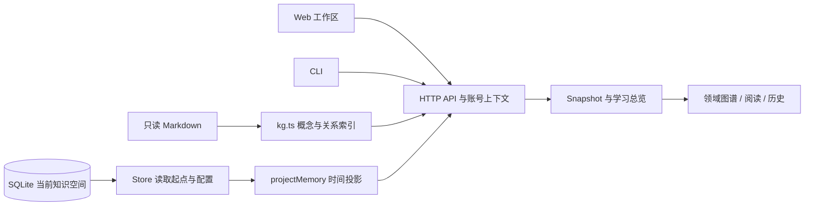

# 开发导览：模块、数据流与验证入口

核对日期：2026-10-01，基于当前 `develop` 的本地 Web 实现。先按[新人运行指南](first-run.md)启动合成示例，再结合本页定位代码；贡献流程和产品语义以[协作说明](../../CONTRIBUTING.md)为准。[首批协作任务](../planning/first-contribution-tasks.md)提供可认领的具体范围。

## 先读这几个入口

| 想理解什么 | 阅读入口 | 职责 |
| --- | --- | --- |
| 页面如何启动 | [main.tsx](../../src/web/main.tsx)、[AuthGate.tsx](../../src/web/AuthGate.tsx)、[App.tsx](../../src/web/App.tsx) | 建号/登录后挂载工作区；App 编排领域、选择、图谱、阅读、练习和数据操作 |
| 服务如何启动 | [index.ts](../../src/server/index.ts)、[app.ts](../../src/server/app.ts) | 监听本机回环地址；建立账号上下文、来源和 Store，校验请求并分派 API |
| README 示意素材如何更新 | [素材说明](../assets/README.md)、`npm run generate:readme-demo` | 生成固定布局的公开合成 SVG/JSON；仅使用 `fixtures/demo-kg`，不访问私人库或导入个人学习数据 |
| Markdown 如何变成图谱 | [kg.ts](../../src/server/kg.ts)、[domain-view.ts](../../src/core/domain-view.ts) | 只读扫描概念、解析双链和来源版本；维护完整索引和按领域展示的视图 |
| 时间颜色如何计算 | [types.ts](../../src/shared/types.ts)、[time-model.ts](../../src/core/time-model.ts)、[store.ts](../../src/server/store.ts) | 定义事件/状态契约；从重温起点、资料版本、时间和全局 H 投影状态 |
| 学习记录保存在哪里 | [store.ts](../../src/server/store.ts)、[accounts.ts](../../src/server/accounts.ts) | 学习数据按知识空间写入 SQLite；账号与登录会话使用独立的 SQLite 库 |

先沿一个功能阅读对应函数和测试，无需一次读完 App 或 Store。当前两者仍承担较多编排；拆分应随具体职责渐进进行。

## 模块责任与对应测试

| 模块 | 关键文件 | 可从哪些测试开始 |
| --- | --- | --- |
| 时间模型与演示投影 | [time-model.ts](../../src/core/time-model.ts)、[demo-snapshot.ts](../../src/core/demo-snapshot.ts) | [time-model.test.ts](../../tests/time-model.test.ts)、[demo-snapshot.test.ts](../../tests/demo-snapshot.test.ts) |
| 知识解析与领域视图 | [kg.ts](../../src/server/kg.ts)、[domain-view.ts](../../src/core/domain-view.ts) | [kg.test.ts](../../tests/kg.test.ts)、[domain-view.test.ts](../../tests/domain-view.test.ts)、[domain-api.test.ts](../../tests/domain-api.test.ts) |
| 图谱、选择与镜头 | [GraphView.tsx](../../src/web/GraphView.tsx)、[ConceptSearch.tsx](../../src/web/ConceptSearch.tsx)、`graph-*.ts` 辅助模块 | [graph-overview.test.ts](../../tests/graph-overview.test.ts)、[graph-focus.test.ts](../../tests/graph-focus.test.ts)、[graph-2d.test.ts](../../tests/graph-2d.test.ts)、[concept-search.test.ts](../../tests/concept-search.test.ts) |
| 资料阅读与附件 | [ConceptReader.tsx](../../src/web/ConceptReader.tsx)、[MarkdownView.tsx](../../src/web/MarkdownView.tsx)、[MarkdownContent.tsx](../../src/web/MarkdownContent.tsx)、[MarkdownImage.tsx](../../src/web/MarkdownImage.tsx)、[MermaidDiagram.tsx](../../src/web/MermaidDiagram.tsx)、[attachments.ts](../../src/server/attachments.ts) | [concept-reader.test.ts](../../tests/concept-reader.test.ts)、[markdown-media.test.ts](../../tests/markdown-media.test.ts)、[mermaid-renderer.test.ts](../../tests/mermaid-renderer.test.ts)、[attachments.test.ts](../../tests/attachments.test.ts) |
| 少量复习与作答 | [brief-review.ts](../../src/core/brief-review.ts)、[BriefReviewPanel.tsx](../../src/web/BriefReviewPanel.tsx)、[ScenarioPractice.tsx](../../src/web/ScenarioPractice.tsx)、[LearningEvidenceFields.tsx](../../src/web/LearningEvidenceFields.tsx) | [brief-review-api.test.ts](../../tests/brief-review-api.test.ts)、[brief-review-session.test.ts](../../tests/brief-review-session.test.ts)、[scenario-practice.test.ts](../../tests/scenario-practice.test.ts)、[source-exposure.test.ts](../../tests/source-exposure.test.ts) |
| 历史、总览与比较 | [learning-overview.ts](../../src/core/learning-overview.ts)、[time-recall.ts](../../src/core/time-recall.ts)、[learning-progress.ts](../../src/core/learning-progress.ts)、[ConceptHistoryPanel.tsx](../../src/web/ConceptHistoryPanel.tsx)、[LearningOverviewDialog.tsx](../../src/web/LearningOverviewDialog.tsx) | [concept-history-api.test.ts](../../tests/concept-history-api.test.ts)、[learning-overview-api.test.ts](../../tests/learning-overview-api.test.ts)、[time-recall.test.ts](../../tests/time-recall.test.ts)、[learning-progress.test.ts](../../tests/learning-progress.test.ts) |
| 应用记录与人工修正 | [ApplicationRecordDialog.tsx](../../src/web/ApplicationRecordDialog.tsx)、[ApplicationCorrectionPanel.tsx](../../src/web/ApplicationCorrectionPanel.tsx)、[CorrectionOverview.tsx](../../src/web/CorrectionOverview.tsx)、[correction-overview.ts](../../src/core/correction-overview.ts) | [application-api.test.ts](../../tests/application-api.test.ts)、[correction-store.test.ts](../../tests/correction-store.test.ts)、[correction-overview.test.ts](../../tests/correction-overview.test.ts) |
| 复习安排与续做 | [useReviewPlan.ts](../../src/web/useReviewPlan.ts)、[ReviewPlanControls.tsx](../../src/web/ReviewPlanControls.tsx)、[brief-review-checkpoint.ts](../../src/web/brief-review-checkpoint.ts)、[brief-review-resume.ts](../../src/web/brief-review-resume.ts)、[brief-review-session.ts](../../src/web/brief-review-session.ts) | [review-plan-api.test.ts](../../tests/review-plan-api.test.ts)、[brief-review-checkpoint.test.ts](../../tests/brief-review-checkpoint.test.ts)、[review-arrangement-web.test.ts](../../tests/review-arrangement-web.test.ts) |
| 账号和知识空间隔离 | [accounts.ts](../../src/server/accounts.ts)、[account-session.ts](../../src/server/account-session.ts)、[storage-paths.ts](../../src/server/storage-paths.ts) | [accounts.test.ts](../../tests/accounts.test.ts)、[private-accounts-api.test.ts](../../tests/private-accounts-api.test.ts)、[storage-paths.test.ts](../../tests/storage-paths.test.ts) |
| HTTP 请求边界 | [app.ts](../../src/server/app.ts) | [http-boundaries-api.test.ts](../../tests/http-boundaries-api.test.ts)：无效 JSON、普通接口 1 MiB 上限、OPTIONS 与未知 API；[server.test.ts](../../tests/server.test.ts)：host/origin/token 校验 |
| 导入与人工身份衔接 | [import-plan.ts](../../src/server/import-plan.ts)、[import-backup.ts](../../src/server/import-backup.ts)、[identity-source.ts](../../src/server/identity-source.ts)、[ImportDataDialog.tsx](../../src/web/ImportDataDialog.tsx)、[IdentityDialog.tsx](../../src/web/IdentityDialog.tsx) | [import-api.test.ts](../../tests/import-api.test.ts)、[import-store.test.ts](../../tests/import-store.test.ts)、[identity-api.test.ts](../../tests/identity-api.test.ts) |
| 请求、待同步与变化通知 | [api.ts](../../src/web/api.ts)、[session-recovery.ts](../../src/web/session-recovery.ts)、[pending-coordination.ts](../../src/web/pending-coordination.ts)、[request-deadline.ts](../../src/web/request-deadline.ts)、[changes.ts](../../src/server/changes.ts)、[change-sync.ts](../../src/web/change-sync.ts) | [pending-writes.test.ts](../../tests/pending-writes.test.ts)、[pending-tabs.test.ts](../../tests/pending-tabs.test.ts)、[request-timeout-api.test.ts](../../tests/request-timeout-api.test.ts)、[server-changes.test.ts](../../tests/server-changes.test.ts) |
| 主题 | [ThemeProvider.tsx](../../src/web/ThemeProvider.tsx)、[theme-palette.ts](../../src/web/theme-palette.ts)、[graph-theme.ts](../../src/web/graph-theme.ts)、[theme-preferences.ts](../../src/web/theme-preferences.ts) | [theme-palette.test.ts](../../tests/theme-palette.test.ts)、[graph-theme.test.ts](../../tests/graph-theme.test.ts)、[theme-preferences.test.ts](../../tests/theme-preferences.test.ts) |
| CLI 与可选 KG 钩子 | [CLI index.ts](../../src/cli/index.ts)、[device-session.ts](../../src/cli/device-session.ts)、[install-kg-hook.ts](../../src/integrations/install-kg-hook.ts)、[living_memory_hook.py](../../integrations/progressive-kg/living_memory_hook.py) | [cli.test.ts](../../tests/cli.test.ts)、[device-session.test.ts](../../tests/device-session.test.ts)、[kg-hook.test.ts](../../tests/kg-hook.test.ts) |

`src/shared` 存放跨端类型与契约，`src/core` 聚合和比较学习证据，`src/server` 负责来源、账号、校验与持久化，`src/web` 管理交互与浏览器本机状态。CLI 通过同一 HTTP 服务工作；当前没有另一个 CLI 记忆模型。

## 三层数据不要混淆

| 数据 | 来源/位置 | 用途与边界 |
| --- | --- | --- |
| 知识正文与附件 | 只读知识根目录，默认 `fixtures/demo-kg` | `type: concept` Markdown 形成概念与关系，正文可进入 Snapshot 与阅读器；图片附件按需读取，两者不写入学习数据库 |
| 账号与登录会话 | 数据目录下 `accounts.sqlite` | 保存用户、密码哈希、登录会话及账号元数据 |
| 个人学习记录 | 数据目录下 `living-memory.sqlite` | 重温、观察、长期保持、应用、修正、配置、计划和布局按 namespace 隔离；各成员可共用同一个数据库文件 |
| JSON 交换数据 | `/api/export` 与导入/身份衔接前备份 | 支持的学习数据及来源元数据；不含知识正文、附件或账号密码，不是完整应用备份 |

浏览器还保存待同步记录、复习草稿和界面偏好。它们不是服务器数据库的一部分；同一浏览器多页面的协调不等于跨设备同步。默认数据路径、备份范围与成员知识目录见[新人运行指南](first-run.md#4-数据保存在哪里)。

## 读取与显示：一条完整路径



1. `createApp` 建立来源与 Store。账号模式下，中间件先验证身份，再由 `contextForUser` 选择该用户的知识源、namespace 和变化通知通道。
2. `loadKnowledgeGraph` 扫描 Markdown、解析双链、计算内容 revision；保留完整 `index` 和受范围/数量限制的 `graph`。完整索引用于全库查询与领域选择，显示范围不会删掉原知识。
3. `GET /api/snapshot` 由 `Store.getStates` 读取重温起点、配置和长期保持，再调用 `projectMemory`。`scope=all` 取得完整索引，省略 `scope` 使用受限图谱；显式 `scope=default` 会被判为无效参数。
4. Web 的 `api.ts` 读取 session、Snapshot 和布局；App 选择领域及节点，GraphView 渲染布局、时间颜色和镜头，阅读组件展示目标资料。
5. `/api/changes` 的 SSE 是同一服务进程内的失效通知。Web 接收后重新读取相应数据；它不传送知识合并补丁，也不提供线上协作。

`POST /api/refresh` 重新扫描同一知识源并通知页面。扫描/查询/刷新都不创建重温起点。

## 写入：本人动作与证据分开

| 用户动作 | API / Store 入口 | 对记忆时间的影响 |
| --- | --- | --- |
| 明确确认重温或补记估计日期 | `POST /api/reviews` → `Store.addReview` | 写入 anchor；记录确认/估计性质及对应资料版本 |
| 保存概念解释或场景回忆观察 | `POST /api/observations` → `Store.addObservation` | 保存回答、自评、曝光和信心/核对证据；冻结观察时的时间指标、H 和配置版本，不更新 anchor |
| 固定长期保持 / 手工解除 | `POST /api/retentions` → `Store.addRetention` | active 时以 `retained` 覆盖时间衰减，资料版本、H 或起点变化不自动解除；只有本人解除才恢复 |
| 保存实际应用与总结、处理修正建议 | `POST /api/applications`、`POST /api/corrections` | 保留应用/处理链，不确认重温或自动改评分 |
| 变更模型参数、计划或布局 | `PUT /api/config`、`PUT /api/review-plan`、`PUT /api/layout` | 各有独立契约；配置改变当前及后续投影，已冻结的观察指标不改写 |

Web 写入由 `api.ts` 处理 session/source 标识、待同步队列与重试；`pending-coordination.ts` 协调同一知识空间多个页面，`request-deadline.ts` 限制请求及正文读取时间。成功后更新快照/历史；超时或结果未知时保留原记录和事件标识，不能靠生成新事件“重试”。服务端继续验证身份、来源版本、参数、重复事件与冲突。

少量复习的候选来自 `selectBriefReviewCandidates`，选择、跳过或结束不写重温。阅读曝光由 `source-exposure.ts` 按来源/概念/版本跟踪；先看资料或受到提示的回答不能标成独立回忆证据。总览的时间比较使用观察时冻结的数据，概念解释和场景任务分别比较，不产生自动测得的记忆能力分数。

## 隔离与恢复边界

管理员沿用配置的知识根目录和原学习空间；新成员使用数据目录内自己的 `users/<账号 ID>/knowledge`。Store 查询按 namespace 隔离，账号上下文和来源校验同时约束图谱、附件、历史、布局、导出与通知。不能把 UI 过滤当作隔离实现。

导入和概念改名/移动均先预览、人工确认、检查来源/版本/冲突，并在写入前保存学习数据备份。`identity-source.ts` 只应用已经确认的身份绑定，不自动猜测移动关系。变更请求和旧 JSON 的兼容要结合 [shared 契约](../../src/shared/import-data.ts)、[导入说明](learning-data-import.md)和[身份说明](concept-identity.md)评估。

当前仍是本机账号隔离：服务监听回环地址，没有共享知识空间、线上多人合并或跨设备同步。ChatGPT 语音和 Obsidian 插件属于后续接入；KG 钩子是纯代码的成功收尾刷新，不调用 LLM，也不会自动确认重温。

CLI 只接受本机回环 HTTP，通过同一 API 工作，不直接打开 Store 或连接远程服务。`query` 执行刷新后检索完整快照；`review` 需要 `--confirm`，失败后用原事件回执 `retry`。可选 Python 钩子在 progressive-kg 的 `query/ingest/consolidate` 成功收尾时调用 CLI `after`，后者只刷新知识源，再由 SSE 提醒 Web 重新读取。安装器和 Python 钩子分开；普通开发不需要安装钩子或访问外部知识库。

## 找到功能后如何验证

先运行与改动直接相关的测试；例如只检查知识解析：

```bash
node --import tsx --test tests/kg.test.ts
```

`npm test` 的脚本已经展开 `tests/*.test.ts`，不能把 `npm test -- tests/kg.test.ts` 当作只运行一个文件的命令。正式提交按[贡献验证表](../../CONTRIBUTING.md#按范围验证)完成必要检查；代码改动通常还需 `npm test` 和 `npm run build`，主题另需 `npm run check:theme-build`。

浏览器回归入口是 [playwright.config.ts](../../playwright.config.ts)和 [tests/e2e](../../tests/e2e)：使用合成账号、示例知识源和独立数据目录。CI 执行 Chromium 回归，不能由此推断真实 GPU、Windows/macOS 或学习收益已验收；本地视觉验证由用户进行。文档改动检查本地链接与 `git diff --check`，无需重复跑完整应用测试。

当前模型固定为 `time-only-v0`，`D(t) = 2^(-t/H)` 是时间提示，H 由本人配置。回忆、自评、信心和应用结果参与记录与对照，尚未自动拟合 H 或调度模型。模型扩展应先讨论研究证据、资料版本、曝光条件及旧数据恢复，再进入实现。
