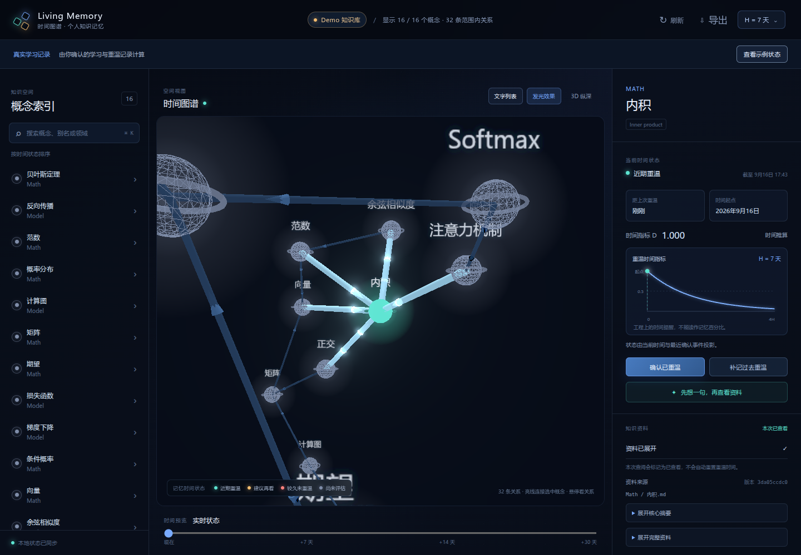

# P0 实现与验证记录

日期：2026-09-16。范围为 `time-only-v0` 独立 Web 原型，不代表完整 v0.1 的 23 项验收已完成。

## 当前实现

React + TypeScript 界面、`3d-force-graph` + Three.js 图谱、Express 本地服务、Node 内置 SQLite。领域计算放在 `src/core`，共享契约在 `src/shared`，文件读取与存储在 `src/server`，页面在 `src/web`；后续宿主和通道复用领域逻辑与服务。

P0 使用一个全局 H，默认 7 天。`D = 2^(-Δt/H)` 仅作为时间指标。明确确认学习/重温才建立起点；查询、回忆自评和模拟时间不改变起点。缺少起点保持未知，来源版本变化保持待确认，历史补记标为估计。

已实现只读 KG 导入、来源/版本标识、状态图例、3D/2D 与文字列表、搜索和来源阅读、模拟时间、可选先答后看的回忆观察、事件持久化、待同步重试、参数历史和 JSON 导出。原始 KG 正文与学习记录分别保存。

## 已执行检查

环境：Linux / Node.js 22.23.1，Chromium 153 使用 SwiftShader 软件渲染。软件渲染用于检查页面行为，不用于推断用户设备的 GPU 性能。

| 检查 | 结果 | 覆盖内容 |
| --- | --- | --- |
| `npm test` | 38/38 通过 | 9 项时间模型、11 项模拟数据、5 项 KG 解析、8 项存储/API、5 项镜头聚焦测试 |
| `npm run build` | 通过 | 严格 TypeScript 检查与生产构建；3D 依赖包体约 1.69 MB（gzip 约 462 KB），保留体积提示 |
| 真实 KG 只读导入 | 通过 | 数学目录全部 87 个概念、386 条范围内关系；86 个连通、1 个孤立，15 条关系目标缺失诊断，不自动造边 |
| Chromium 端到端 | 8/8 通过 | 实际 WebGL、重温与模拟、页面重载、切换列表后重建图谱、回忆遮蔽与观察、补记与导出、断线重试；示例数值/颜色/持久化/导出与真实数据隔离、扩大范围时保留并补充示例档案、发光开关 |

已检查最终实际界面截图：中文、状态颜色、节点与关系线正常显示；来源版本号不会撑破侧栏。以下为合成演示数据，重温状态由测试操作产生：

真实来源路径、正文、学习数据库和原始浏览器测试产物未纳入版本控制；文档仅保留选定的合成数据截图。测试使用合成知识与临时数据库；真实 KG 检查未写入来源文件。

修复并纳入检查的边界包括：查询不写学习事件、同一事件重试不重复、重启仍保留历史、来源间隔离、模拟时间早于起点显示待确认、跨目录关系解析、内容变化后保留旧历史、离线重试保留实际操作时间、观察保留当时参数/起点与提示条件。

本轮已补充[初始模拟值与连线检查](time-colors-and-links.md)：H=7 的固定示例档案、颜色计数与初始数值表、独立导出、提高连线对比度与选中关系高亮。扩大范围后保留并补充模拟档案；实际 87 节点浏览器检查覆盖颜色变化、重载、26 条选中关系高亮、2D 切换、发光开关和长标签，学习历史、配置与布局对比保持一致，检查过程没有 API 写入。

发光使用节点光晕与 Bloom，并补齐最终输出转换、显式场景背景，避免渲染缓冲切换导致背景变亮。浏览器对发光开 / 关 / 再开启三种状态采样背景像素，检查仍接近 `#070c18`。长标签最多三行，完整文字保留在悬停与详情；点击按当前视角向节点推进并居中，重复点击可重新聚焦，2D 保持平面视角。浏览器测试使用 4318，不占用日常原型的 4317。

## 尚未验证与后续范围

- 用户桌面 GPU 的帧率、功耗和长时间资源使用；300 节点性能尚未验收。
- 实际日常操作负担与经过真实时间后的回忆表现。时间模拟不能代替延迟试用，也不证明记忆提升。
- progressive-kg 的生成/查询自动触发、专用 CLI、ChatGPT 原生语音资源访问与 Obsidian 插件。
- 多维记忆模型、场景提取任务、自动评分和调度。
- 重命名/拆分后的身份重联、完整数据迁移与 JSON 导入恢复界面。

下一步按[运行与试用说明](p0-running.md)使用少量概念，先核对时间提示与实际体验的误差，再选择需要新增的变量。
