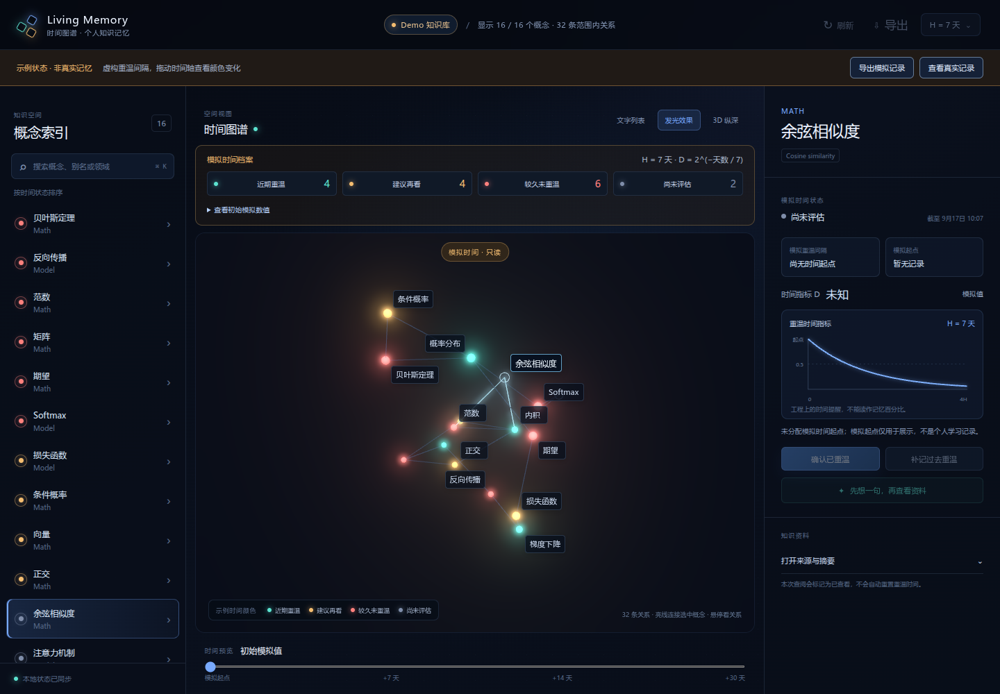
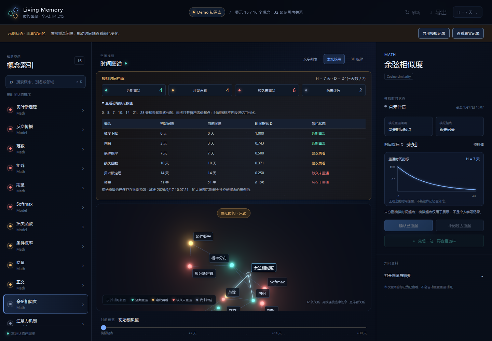

# 初始时间颜色示例与连线检查

日期：2026-09-17（基于 2026-09-16 的初始记录更新）。对应 P0 第二轮体验：先用模拟数值观察颜色和时间变化，并记录连线与图谱标签的视觉细化。具体视觉调整见[视觉细化记录](visual-refinement.md)。

## 初始模拟值

使用现有的 `time-only-v0`，固定 H = 7 天。以下档位按概念 ID 稳定排序后循环分配，与概念难度、个人掌握程度无关：

| 模拟重温间隔 | D = 2^(−天数 / 7) | 时间颜色 | 标签 |
| --- | --- | --- | --- |
| 0 天 | 1.000 | 青绿 | 近期重温 |
| 3 天 | 0.743 | 青绿 | 近期重温 |
| 7 天 | 0.500 | 琥珀 | 建议再看 |
| 10 天 | 0.371 | 琥珀 | 建议再看 |
| 14 天 | 0.250 | 珊瑚 | 较久未重温 |
| 21 天 | 0.125 | 珊瑚 | 较久未重温 |
| 28 天 | 0.063 | 珊瑚 | 较久未重温 |
| 未知 | 无数值 | 灰蓝 | 尚未评估 |

例如向后模拟 7 天，原先 0 天的节点变为 D=0.500、琥珀色；原先 7 天的节点变为 D=0.250、珊瑚色。未知节点仍然未知。D 是时间指标，不是测量得到的记忆百分比。

首次打开默认进入“示例状态 · 非真实记忆”。中间的模拟档案显示各颜色数量；展开“查看初始模拟数值”可对照每个概念的初始间隔、当前间隔和 D。右侧详情也显示 D。切换“查看真实记录”后使用真实学习事件，学习操作重新开放。

## 记录与复现

每个知识源在当前浏览器单独保存模拟档案：生成时间、固定基准时间、H、概念与内容版本、分配的初始间隔。页面重载复用这份档案，不重新随机分配；模拟偏移天数和查看模式也保留。扩大加载范围后刷新页面，会按新增概念 ID 排序，续接原档案的间隔序列，保留已有分配和原时间起点；缩小范围不删除旧分配。浏览器禁止本地存储时，仅本页保留，仍可导出。

“导出模拟记录”下载独立的 `living-memory-demo-*.json`，包含原始分配和当前预览结果，标识为 `kind: living-memory-demo`。它不使用真实学习数据的导出格式，也不写入 SQLite 的重温、观察、参数或布局记录。此轮仅提供导出，尚未提供模拟档案导入界面。

真实记录和模拟档案分别使用自己的时间起点。模拟模式中的重温确认、历史补记、自评、配置和待同步重试均禁用；切换模式时取消尚未执行的延迟布局写入，并重建图谱实例，避免示例期间拖动的位置被后续真实布局保存。来源版本变化后旧模拟起点显示待确认；尚未纳入模拟档案的概念保持未知，直到页面重新载入时补充分配。分档序列中专门保留的未知状态不会被覆盖。

## 为什么原来连线较少

本轮对数学目录前 20 个概念的只读检查结果：

- 数学目录可选概念为 87 个，当前仅加载 20 个。
- 子图内有 15 条关系，9 个节点在这个子图内没有相邻边。
- 选中范围的出边中另有 66 条指向未加载节点，相应连线不显示。
- 仍有 1 个关系目标缺失的诊断，需要回到知识源核对。

因此同时存在展示范围较小和线条对比不足两个因素。当前关系线保留引擎原生的 1px 屏幕线宽，方向箭头仅在节点悬停时显示；选中概念时加亮其相邻边，其他边仍可见。悬停连线可查看关系类型和说明。顶部明确显示“已加载 / 可选概念数”和“范围内关系数”。箭头沿来源关系记录的方向呈现，不表示因果方向。

## 扩大到完整数学目录

本轮已将日常服务切换为 `LM_KG_LIMIT=100`，载入当前数学目录全部 87 个概念；可按[运行说明](p0-running.md)复现。

| 指标 | 原先截取 20 个 | 完整 87 个 |
| --- | ---: | ---: |
| 范围内关系记录 | 15 | 386 |
| 唯一无向节点对 | 8 | 220 |
| 无邻接边节点 | 9 | 1 |
| 无向连通分量 | 13 | 2 |
| 关系目标缺失诊断 | 1 | 15 |

完整图中 86 个节点相互连通，另有 1 个孤立节点。386 是来源中的有向关系记录数；同一节点对可以存在多个关系，因此不等于屏幕上互不重叠的线条数量。15 个目标缺失诊断需要后续核对知识源，本轮不补造关系。

完整范围更适合判断知识结构，真实学习试用仍可只挑选其中 10–20 个概念。高密度图谱的可读性与桌面 GPU 性能需要在实际设备体验；按概念展开一到两层邻居保留为后续交互设计。

## 发光、连线与长标签

图谱默认启用节点光晕和 Bloom 泛光；顶部“发光效果”可开关，关闭后跳过 Bloom 并隐藏光晕。时间颜色仍使用原来的档位；光晕和 Bloom 保持当前状态的颜色分档，不沿用节点最初的颜色。后处理目标的 MSAA 采样数设有 4 的上限。

节点名称已经移到不受 Bloom 和镜头缩放影响的 DOM 屏幕层。普通标签固定为 11px，选中或悬停标签为 12px；画布测量文字宽度并按标题与强调状态缓存，屏幕上最多保留约 12 个标签，优先显示选中、悬停和邻接节点。中文标题带英文括号解释时显示中文主名，否则优先使用已有短 alias，不凭空生成缩写。完整名称保留在节点悬停和右侧详情；选中名称最多占 220px、三行，显示上的缩短不更改来源文本或概念身份。

选中节点仍从当前镜头视角推进并居中，2D 模式沿 Z 轴对准节点。节点近景尺寸限制和 DOM 标签策略的完整取舍见[视觉细化记录](visual-refinement.md)。

点击概念时，镜头从当前视角向该节点推进并以它为中心，不按整张图的范围退回全览。重复点击可重新聚焦；2D 模式沿 Z 轴对准节点。初始布局尚未结束时会保留聚焦请求，避免随后自动全览覆盖点击。仍可用鼠标继续缩放和旋转。

## 检查记录

纯函数检查覆盖初始分配、0/H/2H 边界、未知状态、版本变化、输入不变性和无效模拟记录。浏览器检查覆盖颜色/数值变化、记录复现、独立导出、真实数据隔离，以及选中连线在时间切换后继续显示。具体执行结果更新在 [P0 验证记录](p0-validation.md)。
