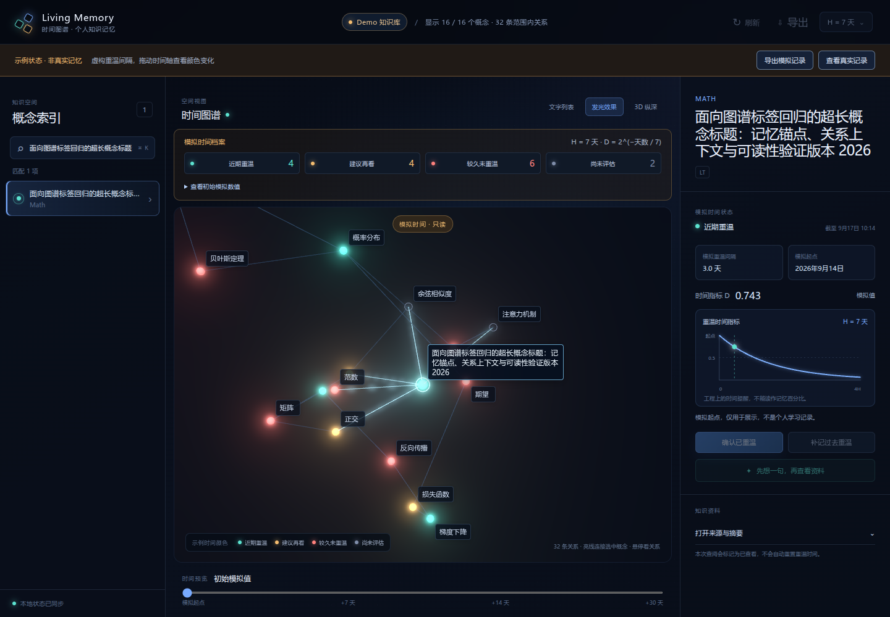

# 3D 图谱视觉细化记录

日期：2026-09-17。范围是独立 Web 原型中的节点、关系、Bloom、镜头和屏幕标签；时间状态的计算与含义保持不变。

## 本轮目标

本轮针对真实中文概念图谱的近景阅读和关系辨认做收敛。旧实现把粗圆柱、重复的世界空间缩放和 Three.js 世界空间标签叠加在一起：镜头靠近时几何体容易变成遮挡视野的粗棒，重复缩放增加了近景调试的不确定性，长名称即使换行也会随镜头变化而变得难读。标签因此移到独立的 DOM 屏幕层，节点和关系则回到更简单、稳定的 Three.js 对象。

实现参考了 `3d-force-graph` 的官方示例源码：

- [Bloom effect 官方源码](https://github.com/vasturiano/3d-force-graph/blob/master/example/bloom-effect/index.html)：使用默认节点/细线、悬停名称和 Bloom 后处理。
- [Text nodes 官方源码](https://github.com/vasturiano/3d-force-graph/blob/master/example/text-nodes/index.html)：Three.js 文本对象和空间文字密度的参考。

这些示例用于确认引擎接入方式，不代表把示例中的世界空间文字或样式直接作为产品默认行为。

## 当前渲染约束

| 部分 | 当前行为 | 目的 |
| --- | --- | --- |
| 节点几何 | 使用单位球体，32 个径向分段；视觉基准半径为 2.2 | 保留圆润节点轮廓，消除重复放大 |
| 关系线 | 使用引擎原生的 1px 屏幕线；方向箭头只在节点悬停时显示 | 保持完整关系可见，避免永久箭头和粗线把密集子图画成条带 |
| 选中与关系 | 选中节点及其邻接边提高对比度，其他边仍保留可见性 | 提供局部焦点，不抹掉整体结构 |
| 光晕与 Bloom | 光晕颜色随时间状态分档；Bloom 可开关，最终颜色输出保持深色背景和状态色 | 让发光增加层次，不改变状态含义 |
| 抗锯齿 | Bloom 后处理的渲染目标 MSAA 采样数上限为 4 | 清理小节点和细线轮廓，同时限制额外 GPU 成本 |
| 近景节点尺寸 | 普通节点屏幕半径不超过约 6px，选中节点不超过约 8px | 镜头靠近时保留焦点，不让节点变成大圆盘 |
| 镜头 | 保留从当前视角向选中节点推进并居中的 zoom；2D 视图沿 Z 轴聚焦 | 连续选择时维持用户的空间方向感 |

默认全景大小已按用户试用反馈调大至最初约 4 倍：先取得引擎自适应全景的目标和距离，再将镜头到目标的距离缩短至四分之一，以一次过渡进入更近的初始视图。首次加载和普通领域切换使用这个大小，点击节点或跨域跳转的聚焦行为沿用原规则；旋转围绕新视距继续，不会自动缩回原来的全景。

## 空闲旋转（2026-09-17）

3D 图谱在初次布局与全景定位完成后，默认缓慢顺时针旋转，约 3 分钟一圈。点击、鼠标移动、拖拽、滚轮、键盘或输入操作会暂停旋转；从最后一次人工操作起，连续 2 分钟无操作才恢复。页面侧栏中的操作也计入等待，切换领域、示例模式或文字列表不会清空等待时间。

旋转由镜头绕当前观察中心运动实现。整体浏览时沿用图谱中心，点击聚焦后沿用选中点，保持镜头距离和高度；节点坐标、关系和记忆时间不参与旋转计算。工具栏的「自动旋转」可以关闭此效果；2D、页面隐藏或回忆/编辑期间停转。系统要求减少动态效果时默认关闭开关，用户手动开启后可以正常旋转。

实现复用现有呈现帧循环，按实际时间差计算角度，并限制长帧间隔，避免恢复标签页后突然补转。新增固定时钟与 Three.js 数学测试验证两分钟规则和镜头不变量；本轮 `npm test` 90 项及 `npm run build` 均通过。浏览器视觉验收继续由用户进行，未启动浏览器或执行 Playwright。

同日停转反馈修正：旧版会把窗口焦点/可见性通知当成新输入，额外延后两分钟，并在开关开启时仍受系统动态偏好阻止。现在生命周期通知只清理指针与帧间隔，不重置人工操作时间；重复坐标的指针通知也不会延后等待。页面显示旋转状态、暂停原因及倒计时，等待期间可以点「立即旋转」，手动开启开关也会立即开始。后续新的人工操作仍遵守两分钟恢复规则。

已补充实际 `TrackballControls` 的连续更新测试，排除控制器把相机位置还原的路径；修正后 `npm test` 95 项及构建通过。本轮没有从用户浏览器读取实际状态，不能据此认定旧版停转只由某一个原因导致。浏览器效果继续由用户核对。

## 屏幕标签

标签层是挂在图谱容器上的绝对定位 DOM 层，`pointer-events: none`，不参与 Bloom，也不随世界坐标缩放。Three.js `Vector3` 将节点坐标投影到屏幕像素；镜头后方、画面外和无法在边界内放置的节点不显示标签。

标签按节点 ID 缓存 DOM 元素，更新时复用已有元素，移除节点时销毁对应元素。更新合并到不超过 30fps 的节奏；文字宽度由画布 `measureText` 按标题和字号缓存，避免每帧触发布局读取。候选位置在节点的上右、下右、左侧等方向之间选择，并按固定间距排除重叠，屏幕上最多显示约 12 个标签。

优先级依次为选中、悬停、邻接和少量上下文节点。普通标签固定使用 11px；选中或悬停标签使用 12px。中文标题在括号中带英文解释时显示中文主名；其他情况下优先使用节点已有的短 alias，例如 `PCA`，不自动编造缩写。完整名称通过节点悬停和右侧详情保留。选中或悬停的长标题最多 220px、三行；普通标签使用 CSS 省略，避免长文本占满图面。

上图只使用合成图谱数据，截图用于检查节点尺寸、状态色、细线、屏幕标签和选中聚焦的组合效果，不包含私有知识库、会话日志或学习记录。

## 数据与边界

本轮只调整渲染和阅读层。API 数据契约、概念 ID、关系端点、时间模型和状态颜色含义不变；标签缩短只影响屏幕显示，不修改来源标题、别名或详情文本。完整正文、公式、来源和学习历史继续通过侧栏或节点入口阅读。

测试、构建和浏览器检查结果集中记录在 [P0 验证记录](p0-validation.md)。同一节点对的多个关系仍可能共线；真实设备的帧率与功耗仍待验证。
