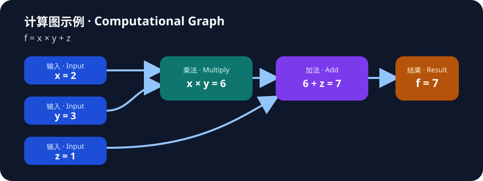
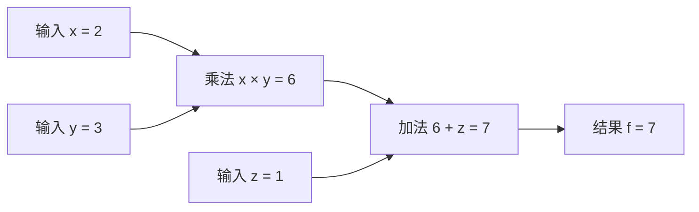

# 计算图

> 计算图用节点和连接表示计算操作及其依赖。

## 核心想法

有向无环的计算图可以安排前向计算顺序，并沿依赖关系传播导数。并非所有知识关系都必须无环。

## 关系网络

- 相关：[[矩阵]] — 对照这个概念理解定义和条件。
- 相关：[[反向传播]] — 沿关系继续探索。

## 示例说明

这是 Living Memory 的简短演示材料，用于验证导入、图谱与时间记录；不是从个人 progressive-kg 复制的学习笔记，也不包含任何真实学习历史。

### 合成示例

用合成数值展示一条前向依赖链：`x = 2` 与 `y = 3` 先相乘得到 `6`，再与 `z = 1` 相加，得到 `f = x × y + z = 7`。

